# Azure Services Quick Reference
## Document Intelligence PDF Processing Pipeline

**Quick Links:**
- [Full Documentation](./azure_services_comprehensive_guide.md)
- [CLAUDE.md Project Instructions](../../CLAUDE.md)

---

## Architecture at a Glance

```mermaid
flowchart LR
    PDF["📄 PDF"] --> Blob["📦 Blob Storage"]
    Blob --> Synapse["🔄 Synapse"]
    Synapse --> Function["⚡ Function"]
    Function --> DocIntel["🤖 Doc Intel"]
    DocIntel --> Cosmos["🗄️ Cosmos DB"]
    Function -.-> KV["🔐 Key Vault"]
    Function -.-> Monitor["📊 Monitoring"]
```



**Core Flow:**
1. Upload PDF to Blob Storage (`incoming/`)
2. Synapse pipeline triggers, lists blobs
3. ForEach activity calls Azure Function per blob
4. Function generates SAS token, calls Document Intelligence
5. Extracted data written to Cosmos DB (partition key: `sourceFile`)
6. Blob moved to `processed/` or `failed/`

---

## Essential Service Details

### Azure Functions
- **SKU:** Consumption (dev), Premium EP1 (prod)
- **Runtime:** Python 3.10+, v2 programming model, Functions v4
- **Key Setting:** `APPLICATIONINSIGHTS_CONNECTION_STRING` for monitoring
- **Auth:** Managed Identity for Cosmos/Storage/Key Vault
- **Timeout:** Increase to 10 min for large PDFs

### Azure Document Intelligence
- **API Version:** 2024-02-29-preview (migrate to 2024-11-30 GA)
- **Rate Limit:** 15 TPS (implement exponential backoff)
- **Regions:** East US, West US2, West Europe (preview)
- **Critical:** Requires SAS token for private blobs
- **Timeout:** 30+ seconds for large PDFs

### Azure Cosmos DB
- **API:** NoSQL API
- **Partition Key:** `sourceFile` (e.g., "folder/document.pdf")
- **SKU:** Serverless (dev), Autoscale 1000-4000 RU/s (prod)
- **Free Tier:** 1000 RU/s + 25 GB (lifetime)
- **Critical:** Always filter by partition key in queries

### Azure Blob Storage
- **SKU:** Standard LRS (dev), Standard GRS (prod)
- **Containers:** `incoming/`, `processed/`, `failed/`
- **Auth:** Managed Identity (disable shared key access)
- **SAS Tokens:** 1-hour expiry for Document Intelligence

### Azure Key Vault
- **SKU:** Standard (Premium for HSM in Federal)
- **Permission Model:** RBAC (not access policies)
- **Secrets:** `FunctionAppHostKey`, `DocIntelKey` (if not using MI)
- **Critical Role:** `Key Vault Secrets User` (NOT `Key Vault Reader`)

### Azure Synapse Analytics
- **Components:** Pipelines + Serverless SQL Pool
- **Artifacts:** Use SINGULAR folder names (`linkedService/`, not `linkedServices/`)
- **Parallelism:** Reduce ForEach `batchCount` to 10-20 (avoid throttling)
- **Pricing:** Serverless SQL: $5/TB data processed

### Monitoring (Log Analytics + App Insights)
- **Workspace:** Centralized for all services
- **Retention:** 30 days free, 31+ charged
- **Sampling:** 5-20 items/sec in App Insights (cost control)
- **KQL:** Query logs for troubleshooting

---

## Critical RBAC Roles

### Function App Managed Identity
```yaml
- Storage Blob Data Contributor (storage account)
- Cosmos DB Built-in Data Contributor (cosmos account)
- Key Vault Secrets User (key vault)
```

### Synapse Workspace Managed Identity
```yaml
- Storage Blob Data Contributor (storage account)
- Key Vault Secrets User (key vault)
- Cosmos DB Built-in Data Reader (optional, for Synapse Link)
```

### Developers/Admins
```yaml
- Website Contributor (function app)
- Key Vault Secrets Officer (key vault, use PIM for JIT)
- Log Analytics Contributor (workspace)
- Synapse Administrator (workspace)
```

---

## Cost Estimates

| Environment | Monthly Cost | Notes |
|------------|--------------|-------|
| **Dev** | $7-37 | Consumption Plan, Serverless Cosmos, F0 Doc Intel |
| **Prod (Moderate)** | $590-640 | Premium EP1, Autoscale 1000 RU/s, 10-20K pages |
| **Prod (High Volume)** | $1,298 | Premium EP2, Autoscale 4000 RU/s, 40K+ pages |
| **Federal (FedRAMP)** | $478-1,142 | Gov pricing +20%, Premium Key Vault (HSM) |

**Cost Optimization Quick Wins:**
- Enable App Insights sampling (saves 70-90% ingestion costs)
- Use Cosmos DB serverless for dev/test
- Set Log Analytics retention to 30 days (free)
- Use Function Consumption Plan for dev (1M executions free)
- Delete unused dev environments outside business hours

---

## Common Gotchas

### 1. Document Intelligence Private Blobs
**Problem:** Document Intelligence cannot access private blobs
**Solution:** Generate 1-hour SAS token in Azure Function

### 2. Key Vault "Access Denied"
**Problem:** Assigned `Key Vault Reader` role
**Solution:** Use `Key Vault Secrets User` (Reader only reads metadata, not secret values)

### 3. Synapse Artifact Deployment Fails
**Problem:** Folder names are plural (`linkedServices/`)
**Solution:** Use singular names (`linkedService/`, `pipeline/`, `dataset/`)

### 4. Cosmos DB High RU Consumption
**Problem:** Queries not filtering by partition key
**Solution:** Always include `WHERE c.sourceFile = @sourceFile`

### 5. Function App Timeouts
**Problem:** Default 1-min timeout in Synapse Web Activity
**Solution:** Increase to 10 minutes for document processing

### 6. Rate Limiting (Document Intelligence)
**Problem:** Hitting 15 TPS limit
**Solution:** Reduce Synapse ForEach `batchCount` to 10-20, implement retry logic

### 7. RBAC Role Not Working
**Problem:** Role assigned but still getting 403 Forbidden
**Solution:** Wait 10 minutes for propagation, then restart Function App

### 8. SAS Token Expired
**Problem:** Document Intelligence returns 403 Forbidden
**Solution:** Generate SAS with 15-min clock skew buffer (`start = now - 15 min`)

---

## Quick Deployment Checklist

### Infrastructure (Bicep)
```bash
# Validate
az deployment sub what-if \
  --location eastus \
  --template-file infra/main.bicep \
  --parameters infra/parameters/dev.bicepparam

# Deploy (subscription-level, creates RG automatically)
az deployment sub create \
  --location eastus \
  --template-file infra/main.bicep \
  --parameters infra/parameters/dev.bicepparam \
  --parameters sqlAdministratorPassword='SecurePassword123!'
```

### Function App Code
```bash
cd src/functions
func azure functionapp publish <function-app-name> --python
```

### Synapse Artifacts
```bash
# Deploy in order: linked services → pipelines
az synapse linked-service create \
  --workspace-name <workspace> \
  --name LS_KeyVault \
  --file @src/synapse/linkedService/LS_KeyVault.json

az synapse pipeline create \
  --workspace-name <workspace> \
  --name ProcessPDFs \
  --file @src/synapse/pipeline/ProcessPDFsWithDocIntelligence.json
```

---

## Monitoring Quick Queries

### Function Execution Times (95th percentile)
```kql
requests
| where cloud_RoleName == "function-app-name"
| summarize percentile(duration, 95) by operation_Name
| order by percentile_duration_95 desc
```

### Document Intelligence Errors
```kql
traces
| where message contains "DocumentAnalysisError"
| project timestamp, message, severityLevel
| order by timestamp desc
```

### Cosmos DB Throttling
```kql
AzureDiagnostics
| where ResourceProvider == "MICROSOFT.DOCUMENTDB"
| where statusCode_s == "429"
| summarize count() by bin(TimeGenerated, 5m)
```

### Synapse Pipeline Failures
```kql
ADFPipelineRun
| where Status == "Failed"
| project TimeGenerated, PipelineName, Status, FailureType
| order by TimeGenerated desc
```

---

## Essential Code Snippets

### Generate SAS Token (Function App)
```python
from azure.storage.blob import generate_blob_sas, BlobSasPermissions
from datetime import datetime, timedelta

sas_token = generate_blob_sas(
    account_name=account_name,
    container_name=container_name,
    blob_name=blob_name,
    account_key=account_key,
    permission=BlobSasPermissions(read=True),
    start=datetime.utcnow() - timedelta(minutes=15),  # Clock skew
    expiry=datetime.utcnow() + timedelta(hours=1)
)
blob_url = f"https://{account_name}.blob.core.windows.net/{container_name}/{blob_name}?{sas_token}"
```

### Cosmos DB Upsert with Managed Identity
```python
from azure.cosmos import CosmosClient
from azure.identity import DefaultAzureCredential

client = CosmosClient(
    url=os.environ["COSMOS_ENDPOINT"],
    credential=DefaultAzureCredential()
)
container = client.get_database_client("DocumentsDB").get_container_client("ExtractedDocuments")

document = {
    "id": blob_name.replace("/", "_").replace(".pdf", ""),
    "sourceFile": blob_name,  # Partition key
    "processedAt": datetime.utcnow().isoformat(),
    "fields": {...}
}
container.upsert_item(document)
```

### Document Intelligence with Retry
```python
from azure.ai.documentintelligence import DocumentIntelligenceClient
from azure.core.credentials import AzureKeyCredential
import time

client = DocumentIntelligenceClient(
    endpoint=os.environ["DOC_INTEL_ENDPOINT"],
    credential=AzureKeyCredential(os.environ["DOC_INTEL_KEY"])
)

for attempt in range(5):
    try:
        poller = client.begin_analyze_document(
            model_id="custom-model-v1",
            analyze_request={"urlSource": blob_url_with_sas}
        )
        result = poller.result()
        break
    except HttpResponseError as e:
        if e.status_code == 429 and attempt < 4:
            time.sleep(2 ** attempt)  # Exponential backoff
        else:
            raise
```

---

## Security Checklist

- [ ] **Managed Identities enabled** for Function App and Synapse Workspace
- [ ] **Shared Key access disabled** on Storage Account
- [ ] **RBAC permission model** enabled on Key Vault (not access policies)
- [ ] **Private endpoints** configured for all services (VNet integration)
- [ ] **Diagnostic Settings** enabled, logs sent to Log Analytics
- [ ] **Application Insights sampling** enabled (5-20 items/sec)
- [ ] **Secrets stored in Key Vault** (no keys in code or config)
- [ ] **SAS tokens short-lived** (1-hour expiry)
- [ ] **Soft delete enabled** on Key Vault and Blob Storage
- [ ] **Log level set to Warning/Error** in production (not Debug)

---

## Federal Compliance Notes

**Authorized Regions:** USGov Virginia, USGov Arizona, USGov Texas

**Government Endpoints:**
- Document Intelligence: `https://{location}.api.cognitive.microsoft.us`
- Cosmos DB: `https://{account}.documents.azure.us`

**Key Requirements:**
- Premium Key Vault (FIPS 140-2 Level 2 HSM)
- Private endpoints for all services (no public access)
- Audit logging enabled for FISMA compliance
- Gov pricing: ~20% higher than commercial

---

## Next Steps

1. **Read Full Documentation:** [azure_services_comprehensive_guide.md](./azure_services_comprehensive_guide.md)
2. **Review Project Instructions:** [CLAUDE.md](../../CLAUDE.md)
3. **Deploy Infrastructure:** Use `infra/parameters/dev.bicepparam` for testing
4. **Configure Monitoring:** Verify Application Insights connection string
5. **Test End-to-End:** Upload sample PDF to `incoming/` folder

---

**Quick Reference Version:** 1.0
**Last Updated:** 2025-12-04
**Full Documentation:** [azure_services_comprehensive_guide.md](./azure_services_comprehensive_guide.md)
