# 🤖 Azure Document Intelligence PDF Processing Pipeline

> **Automated document processing pipeline with PDF splitting, parallel extraction, and intelligent form processing**

---

## 📑 Table of Contents

- [Overview](#-overview)
- [Features](#-features)
- [Architecture](#-architecture)
- [Quick Start](#-quick-start)
- [Documentation](#-documentation)
- [Interactive Notebooks](#-interactive-notebooks)
- [Getting Started](#-getting-started)
- [Deployment Options](#-deployment-options)
- [Local Development](#-local-development)
- [Testing](#-testing)
- [API Reference](#-api-reference)
- [Synapse Pipeline](#-synapse-pipeline)
- [Cosmos DB Schema](#-cosmos-db-schema)
- [Analytics](#-analytics-with-synapse-link-and-delta-lake)
- [Monitoring](#-logging-and-monitoring)
- [Configuration](#-configuration-reference)
- [Troubleshooting](#-troubleshooting)
- [CI/CD Pipeline](#-cicd-pipeline)
- [Docker Support](#-docker-support)
- [Webhook Notifications](#-webhook-notifications)
- [Application Insights](#-application-insights-telemetry)
- [Dead Letter Queue](#-dead-letter-queue)
- [Contributing](#-contributing)

---

## 🎯 Overview

This pipeline automates document processing by:

1. **📄 Splitting multi-page PDFs** into 2-page form chunks automatically
2. **🤖 Extracting data** from PDFs using **Azure Document Intelligence** custom models
3. **⚡ Processing forms in parallel** with rate-limit aware concurrency (3 concurrent calls)
4. **🔄 Orchestrating processing** via **Azure Synapse Analytics**
5. **🗄️ Persisting extracted data** to **Azure Cosmos DB** with PDF source links
6. **📦 Archiving split PDFs** in `_splits/` folder for review
7. **🚀 Deploying infrastructure** via **Bicep** (subscription-level)

---

## ✨ Features

| Feature | Description | Status |
|---------|-------------|--------|
| 🔄 **Auto PDF Splitting** | Splits multi-page PDFs into 2-page form chunks | ✅ |
| ⚡ **Parallel Processing** | 3 concurrent Document Intelligence calls with semaphore | ✅ |
| 📎 **PDF Archive** | Split PDFs stored in `_splits/` folder for user review | ✅ |
| 🔗 **Source Linking** | Each Cosmos DB record links to its processed PDF | ✅ |
| 🤖 **Custom Models** | Support for custom-trained Document Intelligence models | ✅ |
| 🔄 **Batch Orchestration** | Process documents at scale with Synapse pipelines | ✅ |
| 📊 **Real-Time Analytics** | Synapse Link for HTAP analytics without ETL | ✅ |
| 🏗️ **Infrastructure as Code** | Complete Bicep templates (new or existing resources) | ✅ |
| 📈 **Centralized Logging** | Diagnostic settings with Log Analytics integration | ✅ |
| 🔐 **Managed Identity** | Secure authentication without keys where possible | ✅ |
| 📓 **Interactive Notebooks** | Polyglot notebooks for guided workflows | ✅ |
| 🔁 **Auto-Processing Blob Trigger** | Automatic PDF processing on upload to `incoming/` | ✅ |
| 🔄 **Reprocess Failed Documents** | Retry endpoint with configurable max attempts | ✅ |
| ☠️ **Dead Letter Queue** | Failed documents moved to dead letter container | ✅ |
| 📊 **Custom Telemetry** | Application Insights metrics for form processing | ✅ |
| 🔔 **Webhook Notifications** | Notify external systems on processing completion | ✅ |
| 🐳 **Docker Support** | Container-based deployment option | ✅ |
| 🚀 **CI/CD Pipeline** | GitHub Actions for automated testing and deployment | ✅ |
| ✅ **Pre-commit Hooks** | Automated code quality checks | ✅ |

---

## 📚 Documentation

Comprehensive documentation is available in the [`docs/`](./docs/) folder:

| Document | Description |
|----------|-------------|
| [📋 Documentation Index](./docs/README.md) | Full documentation navigation |
| [🔷 Azure Services Guide](./docs/azure-services/README.md) | All Azure services used in this pipeline |
| [🤖 Custom Models Guide](./docs/guides/document-intelligence-custom-models.md) | Building and training custom extraction models |
| [🖥️ Studio Walkthrough](./docs/guides/document-intelligence-studio-walkthrough.md) | Step-by-step Document Intelligence Studio guide |
| [📝 Documentation Standards](./docs/DOCUMENTATION-STANDARDS.md) | Visual and writing guidelines |
| [🏗️ Architecture Diagram](./docs/diagrams/architecture.excalidraw) | System architecture (Excalidraw) |

---

## 📓 Interactive Notebooks

This project includes **Polyglot Notebooks** (`.ipynb`) for step-by-step guidance through all deployment and operational tasks. Find them in the [`notebooks/`](./notebooks/) folder.

| Notebook | Description |
|----------|-------------|
| `00-Getting-Started` | Prerequisites, Azure login, project setup |
| `01-Deployment-New-Resources` | Deploy all Azure resources from scratch |
| `02-Deployment-Existing-Resources` | Deploy with existing Azure resources |
| `03-Local-Development` | Set up local dev environment |
| `04-Testing-Linting` | Run tests, linting, type checking |
| `05-Synapse-Pipeline` | Configure and run pipelines |
| `06-Analytics-SynapseLink` | Synapse Link and Delta Lake analytics |
| `07-Monitoring-Troubleshooting` | Logging, alerts, troubleshooting |

**Requirements:** VS Code with [Polyglot Notebooks extension](https://marketplace.visualstudio.com/items?itemName=ms-dotnettools.dotnet-interactive-vscode) and .NET 8+ SDK.

---

## 🏗️ Architecture

```mermaid
flowchart TB
    subgraph Input["📦 Input"]
        Blob["Blob Storage<br/>(incoming/ PDFs)"]
    end

    subgraph Orchestration["🔄 Orchestration"]
        Synapse["Synapse Pipeline"]
    end

    subgraph Processing["⚡ Azure Function"]
        Trigger["HTTP/Blob Trigger"]
        Split["PDF Splitting<br/>(2-page forms)"]
        Trigger --> Split
    end

    subgraph AI["🤖 Document Intelligence"]
        DocIntel["Parallel Extraction<br/>(3 concurrent)"]
    end

    subgraph Storage["📦 Storage"]
        Splits["Blob Storage<br/>(_splits/ PDFs)"]
        Cosmos["🗄️ Cosmos DB<br/>(results + links)"]
    end

    subgraph Monitoring["📊 Monitoring"]
        KeyVault["🔐 Key Vault<br/>(secrets)"]
        LogAnalytics["📊 Log Analytics"]
        AppInsights["📈 App Insights"]
    end

    Blob --> Synapse --> Trigger
    Split --> DocIntel
    DocIntel --> Splits
    DocIntel --> Cosmos
    DocIntel --> AppInsights --> LogAnalytics --> KeyVault
```



### 📊 Data Flow

1. **📤 PDF Upload** → Blob Storage `incoming/` folder
2. **🔄 Pipeline Trigger** → Synapse discovers new PDFs (batch of 3)
3. **⚡ Function Processing** → Downloads PDF, splits into 2-page chunks
4. **📦 PDF Archive** → Split PDFs uploaded to `_splits/` folder
5. **🤖 Parallel Extraction** → Document Intelligence extracts fields (3 concurrent)
6. **🗄️ Data Storage** → Results saved to Cosmos DB with PDF source links
7. **📊 Monitoring** → Logs sent to Log Analytics and App Insights

---

## 🚀 Quick Start

```bash
# 1. Deploy infrastructure (creates RG automatically)
az deployment sub create \
  --location eastus \
  --template-file infra/main.bicep \
  --parameters infra/parameters/dev.bicepparam \
  --parameters sqlAdministratorPassword='YourSecurePassword123!'

# 2. Deploy function code
cd src/functions && func azure functionapp publish <function-app-name> --python

# 3. Upload a test PDF
az storage blob upload \
  --account-name <storage-account> \
  --container-name pdfs \
  --name incoming/test.pdf \
  --file ./test.pdf

# 4. Trigger pipeline
az synapse pipeline create-run \
  --workspace-name <synapse-workspace> \
  --name ProcessPDFsWithDocIntelligence
```

---

## 📦 Getting Started

### Prerequisites

- [Azure CLI](https://docs.microsoft.com/cli/azure/install-azure-cli) (v2.50+)
- [Azure Functions Core Tools](https://docs.microsoft.com/azure/azure-functions/functions-run-local) (v4.x)
- [UV](https://docs.astral.sh/uv/) (Python package manager)
- Python 3.10+
- Azure subscription with appropriate permissions

### Installation

```bash
# Clone the repository
git clone <repository-url>
cd azure-doc-intel-pipeline

# Install dependencies
uv sync
```

### Azure Subscription Setup

Before deploying, configure your Azure subscription:

```bash
# Login to Azure
az login

# List available subscriptions
az account list --output table

# Set your target subscription
az account set --subscription "<YOUR_SUBSCRIPTION_ID>"

# Verify current subscription
az account show --query "{Name:name, ID:id}" --output table
```

**Optional:** Create a deployment configuration file:
```bash
cp deploy.config.example deploy.config
# Edit deploy.config with your subscription and resource group details
```

---

## 🚀 Deployment Options

Choose the deployment option that best fits your scenario:

| Option | Use Case | What Gets Deployed |
|--------|----------|-------------------|
| **A** | Fresh start, no existing resources | All resources (Storage, Cosmos DB, Doc Intel, Synapse, Key Vault, Function App, Log Analytics) |
| **B** | Have existing resources, have existing Function App | Function code only (to existing Function App) |
| **C** | Have existing resources (same RG), need new Function App | Function App + App Service Plan in current RG |
| **C+** | Have existing resources (different RGs), need new Function App in new RG | Creates new RG + Function App + App Service Plan |

### Cross-Resource-Group Support

All "existing resources" options support resources in **different resource groups**. This is common in enterprise environments where:
- Storage accounts are in a shared data resource group
- Cosmos DB is managed by a database team in their resource group
- Key Vault is in a security/secrets resource group
- Log Analytics is in a monitoring resource group (possibly different subscription)

### Cross-Subscription Log Analytics

Log Analytics workspaces can be in a **different Azure subscription** - common for centralized monitoring in shared services subscriptions. Specify `existingLogAnalyticsSubscriptionId` to enable this.

**Note:** All deployment options support centralized logging. You can:
- Deploy a new Log Analytics workspace (default)
- Use an existing Log Analytics workspace (same or different RG)
- Use an existing Log Analytics workspace in a different subscription
- Disable diagnostic settings entirely

---

### Option A: Deploy Everything New

Use this when starting fresh with no existing Azure resources.

**Step 1: Set Variables**
```bash
# Set your Azure subscription
SUBSCRIPTION_ID="<YOUR_SUBSCRIPTION_ID>"
LOCATION="eastus"
```

**Step 2: Preview Deployment (What-If)**
```bash
az deployment sub what-if \
  --subscription $SUBSCRIPTION_ID \
  --location $LOCATION \
  --template-file infra/main.bicep \
  --parameters infra/parameters/dev.bicepparam \
  --parameters sqlAdministratorPassword='YourSecurePassword123!'
```

**Step 3: Deploy Infrastructure**

The resource group is created automatically by the template:
```bash
az deployment sub create \
  --subscription $SUBSCRIPTION_ID \
  --location $LOCATION \
  --template-file infra/main.bicep \
  --parameters infra/parameters/dev.bicepparam \
  --parameters sqlAdministratorPassword='YourSecurePassword123!'
```

**Step 4: Note Output Values**

After deployment, note the output values for local development:
```bash
az deployment sub show \
  --subscription $SUBSCRIPTION_ID \
  --name main \
  --query properties.outputs
```

**Step 5: Deploy Function Code**
```bash
# Get the function app name from outputs
FUNC_APP_NAME=$(az deployment sub show \
  --subscription $SUBSCRIPTION_ID \
  --name main \
  --query properties.outputs.functionAppName.value -o tsv)

# Deploy function code
cd src/functions && func azure functionapp publish $FUNC_APP_NAME --python
```

---

### Option B: Connect to Existing Resources (Existing Function App)

Use this when you have existing Azure resources and an existing Function App/App Service.

**Step 1: Set Variables**
```bash
SUBSCRIPTION_ID="<YOUR_SUBSCRIPTION_ID>"
RESOURCE_GROUP="<YOUR_RESOURCE_GROUP>"
FUNC_APP_NAME="<YOUR_EXISTING_FUNCTION_APP>"
```

**Step 2: Gather Your Existing Resource Information**

You'll need:
- Document Intelligence endpoint and API key
- Cosmos DB endpoint (with database and container created)
- Key Vault name
- Synapse workspace name
- Storage account name and connection string

**Step 3: Configure Function App Settings**

```bash
az functionapp config appsettings set \
  --subscription $SUBSCRIPTION_ID \
  --name $FUNC_APP_NAME \
  --resource-group $RESOURCE_GROUP \
  --settings \
    DOC_INTEL_ENDPOINT="https://your-doc-intel.cognitiveservices.azure.com" \
    DOC_INTEL_API_KEY="your-api-key" \
    COSMOS_ENDPOINT="https://your-cosmos.documents.azure.com:443/" \
    COSMOS_DATABASE="DocumentsDB" \
    COSMOS_CONTAINER="ExtractedDocuments" \
    KEY_VAULT_NAME="your-keyvault" \
    DEFAULT_MODEL_ID="prebuilt-layout" \
    MAX_CONCURRENT_REQUESTS="10"
```

**Step 4: Deploy Function Code Only**
```bash
cd src/functions && func azure functionapp publish $FUNC_APP_NAME --python
```

**Step 5: Import Synapse Pipeline (Optional)**

If using existing Synapse workspace:
```bash
SYNAPSE_WORKSPACE="your-synapse-workspace"

# Create linked services first (update placeholders in JSON files)
az synapse linked-service create \
  --subscription $SUBSCRIPTION_ID \
  --workspace-name $SYNAPSE_WORKSPACE \
  --name ls_blob_storage \
  --file @src/synapse/linkedServices/ls_blob_storage.json

az synapse linked-service create \
  --subscription $SUBSCRIPTION_ID \
  --workspace-name $SYNAPSE_WORKSPACE \
  --name ls_azure_function \
  --file @src/synapse/linkedServices/ls_azure_function.json

# Create dataset
az synapse dataset create \
  --subscription $SUBSCRIPTION_ID \
  --workspace-name $SYNAPSE_WORKSPACE \
  --name ds_blob_binary \
  --file @src/synapse/datasets/ds_blob_binary.json

# Create pipeline
az synapse pipeline create \
  --subscription $SUBSCRIPTION_ID \
  --workspace-name $SYNAPSE_WORKSPACE \
  --name ProcessPDFsWithDocIntelligence \
  --file @src/synapse/pipelines/process-pdfs-pipeline.json
```

---

### Option C/C+: Connect to Existing Resources (New Function App)

Use this when you have existing backend resources and want to deploy a new Function App. The template automatically creates the resource group if it doesn't exist, making Options C and C+ functionally identical.

**Step 1: Set Variables**
```bash
SUBSCRIPTION_ID="<YOUR_SUBSCRIPTION_ID>"
LOCATION="eastus"
```

**Step 2: Update Existing Resources Parameter File**

Edit `infra/parameters/existing.bicepparam` with your resource details. Resources can be in **different resource groups**:

```bicep
using '../main.bicep'

// Resource group for Function App (created if doesn't exist)
param resourceGroupName = 'rg-docprocessing-functions-dev'
param location = 'eastus'
param deploymentMode = 'existing'
param prefix = 'docproc'
param environment = 'dev'

// Your existing resource names and their resource groups
param existingStorageAccountName = 'your-storage-account'
param existingStorageAccountResourceGroup = 'rg-storage'  // Cross-RG support

param existingCosmosAccountName = 'your-cosmos-account'
param existingCosmosAccountResourceGroup = 'rg-databases'  // Cross-RG support

param existingDocIntelName = 'your-doc-intel'
param existingDocIntelResourceGroup = 'rg-ai-services'  // Cross-RG support

param existingKeyVaultName = 'your-keyvault'
param existingKeyVaultResourceGroup = 'rg-security'  // Cross-RG support

param existingSynapseWorkspaceName = 'your-synapse'  // Optional
param existingSynapseResourceGroup = ''  // Leave empty if not using existing Synapse

// Leave empty to deploy new Function App
param existingFunctionAppName = ''

// Set to true to deploy new Function App infrastructure
param deployFunctionApp = true
param appServicePlanSku = 'S1'  // Y1=Consumption, B1=Basic, S1=Standard

// Database and container settings (created automatically if they don't exist)
param cosmosDatabase = 'DocumentsDB'
param cosmosContainer = 'ExtractedDocuments'

// Enable Synapse Link analytical store on container (requires account-level enablement first)
param enableExistingCosmosAnalyticalStore = false

// Log Analytics - can be in different RG and even different subscription
param existingLogAnalyticsWorkspaceName = 'central-monitoring-workspace'
param existingLogAnalyticsResourceGroup = 'rg-monitoring'
// param existingLogAnalyticsSubscriptionId = '...'  // Set if in different subscription
```

**Step 3: Deploy Function App Infrastructure**

Uses subscription-level deployment (resource group is created automatically):
```bash
az deployment sub create \
  --subscription $SUBSCRIPTION_ID \
  --location $LOCATION \
  --template-file infra/main.bicep \
  --parameters infra/parameters/existing.bicepparam
```

**Step 4: Deploy Function Code**
```bash
# Get the new function app name
FUNC_APP_NAME=$(az deployment sub show \
  --subscription $SUBSCRIPTION_ID \
  --name main \
  --query properties.outputs.functionAppName.value -o tsv)

cd src/functions && func azure functionapp publish $FUNC_APP_NAME --python
```

---

## 💻 Local Development

### Setup Environment Variables

**Option 1: Using `.env` file (Recommended for development/testing)**

```bash
# Copy the example file
cp .env.example .env

# Edit with your values (including AZURE_SUBSCRIPTION_ID)
```

**Option 2: Using `local.settings.json` (For Azure Functions runtime)**

```bash
# Copy the template
cp src/functions/local.settings.template.json src/functions/local.settings.json

# Edit with your values
```

### Required Configuration Values

| Variable | Description | Where to Find |
|----------|-------------|---------------|
| `AZURE_SUBSCRIPTION_ID` | Azure subscription ID | `az account show --query id` |
| `DOC_INTEL_ENDPOINT` | Document Intelligence endpoint | Azure Portal > Doc Intelligence > Keys and Endpoint |
| `DOC_INTEL_API_KEY` | Document Intelligence API key | Azure Portal > Doc Intelligence > Keys and Endpoint |
| `COSMOS_ENDPOINT` | Cosmos DB endpoint URL | Azure Portal > Cosmos DB > Keys |
| `COSMOS_DATABASE` | Database name | Default: `DocumentsDB` |
| `COSMOS_CONTAINER` | Container name | Default: `ExtractedDocuments` |

### Run Functions Locally

```bash
# Start Azure Functions
cd src/functions && func start

# Test health endpoint
curl http://localhost:7071/api/health

# Process a document
curl -X POST http://localhost:7071/api/process \
  -H "Content-Type: application/json" \
  -d '{
    "blobUrl": "https://your-storage.blob.core.windows.net/pdfs/doc.pdf?sas=...",
    "blobName": "incoming/doc.pdf",
    "modelId": "prebuilt-layout"
  }'
```

---

## 🧪 Testing

### Run Unit Tests

```bash
# All unit tests
uv run pytest tests/unit/ -v

# With coverage report
uv run pytest tests/unit/ --cov=src/functions --cov-report=html

# Open coverage report
open htmlcov/index.html  # macOS
start htmlcov/index.html # Windows
```

### Run Integration Tests

Integration tests require deployed Azure resources and a configured `.env` file:

```bash
# Set flag to run integration tests
RUN_INTEGRATION_TESTS=1 uv run pytest tests/integration/ -v
```

### Linting and Type Checking

```bash
# Lint code
uv run ruff check src/ tests/

# Auto-fix lint issues
uv run ruff check --fix src/ tests/

# Format code
uv run ruff format src/ tests/

# Type checking
uv run mypy src/functions/ --ignore-missing-imports
```

---

## API Reference

### POST /api/process

Process a PDF document through Document Intelligence.

**Request:**
```json
{
  "blobUrl": "https://storage.blob.core.windows.net/container/file.pdf?sas=...",
  "blobName": "folder/file.pdf",
  "modelId": "custom-model-v1"
}
```

**Response (200 OK):**
```json
{
  "status": "success",
  "documentId": "folder_file_pdf",
  "processedAt": "2024-01-15T10:30:00Z"
}
```

**Error Responses:**
- `400 Bad Request` - Missing blobUrl or blobName
- `429 Too Many Requests` - Rate limit exceeded
- `500 Internal Server Error` - Processing or database error

### GET /api/status/{blob_name}

Get processing status for a document.

**Response (200 OK):**
```json
{
  "status": "completed",
  "documentId": "folder_file_pdf",
  "sourceFile": "folder/file.pdf",
  "processedAt": "2024-01-15T10:30:00Z"
}
```

**Response (404 Not Found):**
```json
{
  "status": "not_found",
  "blobName": "folder/file.pdf"
}
```

### POST /api/reprocess/{blob_name}

Reprocess a failed document. Increments retry count and moves from dead letter if applicable.

**Response (200 OK):**
```json
{
  "status": "success",
  "message": "Reprocessing started for folder/file.pdf",
  "retryCount": 2
}
```

**Response (404 Not Found):**
```json
{
  "status": "error",
  "message": "Document folder/file.pdf not found"
}
```

**Response (400 Bad Request):**
```json
{
  "status": "error",
  "message": "Document has exceeded max retry attempts (3)"
}
```

### GET /api/status/batch/{blob_name}

Get status for all forms extracted from a multi-page PDF.

**Response (200 OK):**
```json
{
  "sourceFile": "folder/document.pdf",
  "totalForms": 3,
  "documents": [
    {
      "id": "folder_document_pdf_form1",
      "formNumber": 1,
      "status": "completed",
      "processedAt": "2024-01-15T10:30:00Z"
    },
    {
      "id": "folder_document_pdf_form2",
      "formNumber": 2,
      "status": "completed",
      "processedAt": "2024-01-15T10:30:05Z"
    }
  ]
}
```

### DELETE /api/documents/{blob_name}

Delete all documents and split PDFs for a source file.

**Response (200 OK):**
```json
{
  "status": "success",
  "message": "Deleted 3 documents and 3 split PDFs for folder/document.pdf"
}
```

### GET /api/health

Health check endpoint with service connectivity verification.

**Response:**
```json
{
  "status": "healthy",
  "timestamp": "2024-01-15T10:30:00Z",
  "services": {
    "documentIntelligence": "connected",
    "cosmosDb": "connected",
    "blobStorage": "connected"
  }
}
```

### Blob Trigger (Auto-Processing)

PDFs uploaded to `pdfs/incoming/{filename}` are automatically processed.

**Container Path:** `pdfs/incoming/{name}`

**Behavior:**
- Triggers on new blob upload
- Processes PDF using default model (`DEFAULT_MODEL_ID`)
- Stores results in Cosmos DB
- Sends webhook notification on completion (if configured)
- Moves to dead letter container after max retries exceeded

---

## Synapse Pipeline

### Pipeline Parameters

| Parameter | Description | Default |
|-----------|-------------|---------|
| `containerName` | Blob container name | `pdfs` |
| `sourceFolderPath` | Folder path within container | `incoming` |
| `storageAccountUrl` | Storage account blob endpoint | - |
| `modelId` | Document Intelligence model ID | `prebuilt-layout` |

**Note:** The pipeline automatically handles PDF filenames with spaces and special characters by URL-encoding the blob path. Files like `My Document.pdf` are correctly processed.

### Trigger Pipeline Manually

```bash
SUBSCRIPTION_ID="<YOUR_SUBSCRIPTION_ID>"
SYNAPSE_WORKSPACE="your-synapse-workspace"

# Trigger a pipeline run
az synapse pipeline create-run \
  --subscription $SUBSCRIPTION_ID \
  --workspace-name $SYNAPSE_WORKSPACE \
  --name ProcessPDFsWithDocIntelligence \
  --parameters \
    containerName=pdfs \
    sourceFolderPath=incoming \
    modelId=prebuilt-layout
```

### Monitor Pipeline Runs

```bash
# List recent runs
az synapse pipeline-run query-by-workspace \
  --subscription $SUBSCRIPTION_ID \
  --workspace-name $SYNAPSE_WORKSPACE \
  --last-updated-after "2024-01-01T00:00:00Z"
```

### Configure Synapse Authentication to Function App

**IMPORTANT:** The Synapse pipeline calls the Azure Function to process documents. The Function App requires authentication via a function key stored in Key Vault.

#### Step 1: Get the Function App Host Key

```bash
# Get the Function App default host key
FUNCTION_KEY=$(az functionapp keys list \
  --name docproc-func-dev \
  --resource-group rg-docprocessing-dev \
  --query "functionKeys.default" -o tsv)

echo "Function Key: $FUNCTION_KEY"
```

#### Step 2: Store the Function Key in Key Vault

```bash
# Set your Key Vault name
KEY_VAULT_NAME="your-keyvault-name"

# Store the function key as a secret
az keyvault secret set \
  --vault-name $KEY_VAULT_NAME \
  --name "FunctionAppHostKey" \
  --value "$FUNCTION_KEY"
```

#### Step 3: Grant Synapse Managed Identity Access to Key Vault

The Synapse workspace uses its managed identity to read secrets from Key Vault:

```bash
SYNAPSE_WORKSPACE="docproc-syn-dev"
RESOURCE_GROUP="rg-docprocessing-dev"

# Get Synapse workspace managed identity principal ID
SYNAPSE_IDENTITY=$(az synapse workspace show \
  --name $SYNAPSE_WORKSPACE \
  --resource-group $RESOURCE_GROUP \
  --query identity.principalId -o tsv)

echo "Synapse Identity: $SYNAPSE_IDENTITY"

# Grant Key Vault Secrets User permissions
az keyvault set-policy \
  --name $KEY_VAULT_NAME \
  --object-id $SYNAPSE_IDENTITY \
  --secret-permissions get list
```

#### Step 4: Deploy Linked Services with Key Vault Reference

The deployment script will configure the linked services to use Key Vault for the function key:

```powershell
.\scripts\Deploy-SynapseArtifacts.ps1 `
  -WorkspaceName "docproc-syn-dev" `
  -ResourceGroup "rg-docprocessing-dev" `
  -DeploymentMode direct `
  -StorageAccountUrl "https://mystorageaccount.blob.core.windows.net" `
  -FunctionAppUrl "https://docproc-func-dev.azurewebsites.net" `
  -KeyVaultUrl "https://your-keyvault.vault.azure.net/"
```

#### Step 5: Test and Publish in Synapse Studio

1. Open **Synapse Studio** → **Manage** → **Linked services**
2. Click **Test connection** on `LS_KeyVault` (should succeed)
3. Click **Test connection** on `LS_AzureFunction` (should succeed)
4. Click **Publish all** to deploy to the live workspace

#### Troubleshooting Authentication Errors

| Error | Cause | Solution |
|-------|-------|----------|
| `Unauthorized` (401) | Function key not configured or invalid | Verify `FunctionAppHostKey` secret exists in Key Vault |
| `Forbidden` (403) on Key Vault | Synapse can't access Key Vault | Grant Synapse identity `get` and `list` permissions on Key Vault secrets |
| `SecretNotFound` | Wrong secret name | Ensure secret is named exactly `FunctionAppHostKey` |
| `LinkedServiceNotFound` | LS_KeyVault missing | Deploy the Key Vault linked service first |

### Synapse GitHub Integration

The infrastructure supports optional GitHub integration for Synapse workspaces. When enabled, Synapse artifacts (pipelines, linked services, datasets) are managed through Git source control.

**Enable GitHub Integration:**

Update your parameter file:
```bicep
// Enable GitHub integration
param enableSynapseGitHubIntegration = true
param synapseGitHubAccountName = 'your-github-org'
param synapseGitHubRepositoryName = 'your-repo-name'
param synapseGitHubCollaborationBranch = 'main'
param synapseGitHubRootFolder = '/src/synapse'
```

**Deployment Modes:**

| Mode | Use Case | Command |
|------|----------|---------|
| Direct | Workspace without GitHub integration | `Deploy-SynapseArtifacts.ps1 -DeploymentMode direct` |
| GitHub | Synapse configured with THIS repository | `Deploy-SynapseArtifacts.ps1 -DeploymentMode github` |
| External-GitHub | Synapse configured with a DIFFERENT repository | `Deploy-SynapseArtifacts.ps1 -DeploymentMode external-github` |

**Deploy Synapse Artifacts (Direct Mode):**
```powershell
# Deploy artifacts directly to Synapse (no GitHub integration)
.\scripts\Deploy-SynapseArtifacts.ps1 `
  -WorkspaceName "docproc-syn-dev" `
  -ResourceGroup "rg-docprocessing-dev" `
  -DeploymentMode direct `
  -StorageAccountUrl "https://mystorageaccount.blob.core.windows.net" `
  -FunctionAppUrl "https://docproc-func-dev.azurewebsites.net" `
  -KeyVaultUrl "https://your-keyvault.vault.azure.net/"
```

**Deploy Synapse Artifacts (GitHub Mode - This Repository):**
```powershell
# Commit artifacts to GitHub when Synapse uses THIS repository
.\scripts\Deploy-SynapseArtifacts.ps1 `
  -WorkspaceName "docproc-syn-dev" `
  -ResourceGroup "rg-docprocessing-dev" `
  -DeploymentMode github `
  -GitHubBranch "main" `
  -CommitMessage "Update pipeline configuration"
```

**Deploy Synapse Artifacts (External GitHub Repository):**

Use this mode when your **existing Synapse workspace** is configured with GitHub integration pointing to a **different repository** (common in enterprise environments):

```powershell
# Deploy artifacts to an external GitHub repository
.\scripts\Deploy-SynapseArtifacts.ps1 `
  -WorkspaceName "your-existing-synapse" `
  -ResourceGroup "rg-your-synapse-rg" `
  -DeploymentMode external-github `
  -ExternalRepoUrl "https://github.com/your-org/synapse-artifacts.git" `
  -ExternalRepoRootFolder "/synapse" `
  -GitHubBranch "main" `
  -StorageAccountUrl "https://yourstorageaccount.blob.core.windows.net" `
  -FunctionAppUrl "https://your-func-app.azurewebsites.net" `
  -KeyVaultUrl "https://your-keyvault.vault.azure.net/" `
  -CommitMessage "Update document processing pipeline"
```

**Note:** For `external-github` mode, you need push access to the external repository.

**GitHub Workflow:**
1. Edit artifacts in `src/synapse/` folder (this project uses Synapse's singular folder names: `linkedService/`, `dataset/`, `pipeline/`)
2. Run deployment script with appropriate mode
3. For `github`/`external-github`: Changes are committed/pushed to collaboration branch
4. Synapse automatically syncs from GitHub
5. Publish from Synapse Studio to deploy to live workspace

---

## 🗄️ Cosmos DB Schema

Documents are stored with the following structure. Each extracted form from a multi-page PDF gets its own document:

```json
{
  "id": "folder_document_pdf_form1",
  "sourceFile": "folder/document.pdf",
  "processedPdfUrl": "https://storage.blob.core.windows.net/pdfs/_splits/document_form1_pages1-2.pdf?sas=...",
  "processedAt": "2024-01-15T10:30:00Z",
  "formNumber": 1,
  "totalForms": 3,
  "pageRange": "1-2",
  "originalPageCount": 6,
  "modelId": "custom-model-v1",
  "modelConfidence": 0.95,
  "docType": "invoice",
  "fields": {
    "vendorName": "Acme Corp",
    "invoiceTotal": 1500.00,
    "invoiceDate": "2024-01-10"
  },
  "confidence": {
    "vendorName": 0.98,
    "invoiceTotal": 0.95,
    "invoiceDate": 0.99
  },
  "status": "completed",
  "error": null
}
```

| Field | Description |
|-------|-------------|
| `id` | Unique document ID (includes form number for multi-form PDFs) |
| `sourceFile` | Original PDF path (**partition key**) |
| `processedPdfUrl` | SAS URL to the split PDF in `_splits/` folder |
| `formNumber` | Which form in the PDF (1-indexed) |
| `totalForms` | Total forms extracted from the original PDF |
| `pageRange` | Pages from original PDF (e.g., "1-2", "3-4") |
| `originalPageCount` | Total pages in the original PDF |

**Partition Key:** `/sourceFile`

---

## Analytics with Synapse Link and Delta Lake

This pipeline supports real-time analytics using Azure Synapse Link for Cosmos DB and Delta Lake medallion architecture.

### Synapse Link for Cosmos DB

[Synapse Link](https://learn.microsoft.com/en-us/azure/cosmos-db/synapse-link) enables hybrid transactional and analytical processing (HTAP) by automatically syncing operational data to an analytical store. This allows you to run analytics queries without impacting transactional workloads.

**Features:**
- **No ETL Required**: Data automatically syncs to analytical store (2-5 minute latency)
- **No Impact on Transactions**: Analytics queries run against the analytical store
- **Cost-Effective**: Pay only for analytical storage consumed
- **Spark & SQL Support**: Query using Synapse Spark notebooks or SQL Serverless

**Enable Synapse Link (New Deployments):**

Synapse Link is enabled by default in `dev.bicepparam`:
```bicep
param enableCosmosSynapseLink = true
```

**Enable Synapse Link (Existing Cosmos DB):**

For existing Cosmos DB accounts:
1. Azure Portal → Cosmos DB Account → Azure Synapse Link → **Enable**
2. Container → Settings → Analytical store → **On** (set TTL, e.g., `-1` for infinite)

### Synapse Notebooks

The pipeline includes pre-built notebooks in `src/synapse/notebook/`:

| Notebook | Description |
|----------|-------------|
| `Query_CosmosDB_SynapseLink` | Query Cosmos DB analytical store directly via Spark |
| `DeltaLake_Medallion_Architecture` | Build Bronze/Silver Delta Lake layers from Cosmos DB data |

**Query Cosmos DB via Synapse Link:**
```python
# Read from Cosmos DB analytical store
df = spark.read \
    .format("cosmos.olap") \
    .option("spark.synapse.linkedService", "LS_CosmosDB") \
    .option("spark.cosmos.container", "ExtractedDocuments") \
    .load()

# Run analytics
df.createOrReplaceTempView("documents")
spark.sql("""
    SELECT modelId, COUNT(*) as count, AVG(modelConfidence) as avg_conf
    FROM documents
    GROUP BY modelId
""").show()
```

### Delta Lake Medallion Architecture

The `DeltaLake_Medallion_Architecture` notebook implements a medallion architecture:

| Layer | Description | Location |
|-------|-------------|----------|
| **Bronze** | Raw data from Cosmos DB with ingestion metadata | `delta/bronze/extracted_documents/` |
| **Silver** | Cleaned, flattened, partitioned data for analytics | `delta/silver/documents/` |

**Silver Layer Schema:**
```
document_id          STRING    -- Document ID
source_file          STRING    -- Source PDF path
processed_at         TIMESTAMP -- When processed
status               STRING    -- Processing status
model_id             STRING    -- Document Intelligence model
model_confidence     DOUBLE    -- Overall confidence
document_type        STRING    -- Detected document type
extracted_fields_json STRING   -- JSON of extracted fields
_is_valid            BOOLEAN   -- Processing succeeded
```

**Incremental Updates:**

The notebook includes merge patterns for incremental updates:
```python
from delta.tables import DeltaTable

# Merge new data into Bronze layer
delta_bronze = DeltaTable.forPath(spark, bronze_path)
delta_bronze.alias("target").merge(
    df_new.alias("source"),
    "target.id = source.id AND target.sourceFile = source.sourceFile"
).whenMatchedUpdateAll() \
 .whenNotMatchedInsertAll() \
 .execute()
```

### SQL Serverless Queries

Pre-built SQL scripts in `src/synapse/sqlscript/`:

| Script | Description |
|--------|-------------|
| `Query_CosmosDB_Serverless` | Query Cosmos DB analytical store directly via T-SQL |
| `Query_DeltaLake_Serverless` | Query Delta Lake tables via T-SQL |

**Query Delta Lake with SQL Serverless:**
```sql
-- Query Silver layer directly
SELECT status, document_type, COUNT(*) as count
FROM OPENROWSET(
    BULK 'https://<storage>.dfs.core.windows.net/delta/silver/documents/',
    FORMAT = 'DELTA'
) AS docs
GROUP BY status, document_type;
```

### Deploy Analytics Artifacts

**Deploy notebooks and SQL scripts:**
```powershell
# Include notebooks and SQL scripts in deployment
.\scripts\Deploy-SynapseArtifacts.ps1 `
  -WorkspaceName "docproc-syn-dev" `
  -ResourceGroup "rg-docprocessing-dev" `
  -DeploymentMode direct `
  -StorageAccountUrl "https://mystorageaccount.blob.core.windows.net" `
  -CosmosEndpoint "https://mycosmosaccount.documents.azure.com:443/"
```

The deployment script automatically deploys artifacts from:
- `src/synapse/linkedService/` - Linked services
- `src/synapse/dataset/` - Datasets
- `src/synapse/pipeline/` - Pipelines
- `src/synapse/notebook/` - Spark notebooks
- `src/synapse/sqlscript/` - SQL serverless scripts

---

## 📁 Project Structure

```
azure-doc-intel-pipeline/
├── infra/
│   ├── main.bicep                       # Main deployment orchestrator (subscription-level)
│   ├── modules/                         # Reusable Bicep modules
│   │   ├── storage.bicep                # Storage account + diagnostics
│   │   ├── document-intelligence.bicep  # Doc Intel + diagnostics
│   │   ├── cosmos-db.bicep              # Cosmos DB (serverless) + diagnostics
│   │   ├── key-vault.bicep              # Key Vault with RBAC + diagnostics
│   │   ├── function-app.bicep           # Function App + Plan + diagnostics
│   │   ├── synapse.bicep                # Synapse workspace + GitHub integration
│   │   ├── log-analytics.bicep          # Log Analytics workspace
│   │   └── role-assignment.bicep        # Cross-RG role assignments
│   └── parameters/                      # Environment configs
│       ├── dev.bicepparam               # Development environment (new deployment)
│       ├── prod.bicepparam              # Production environment (new deployment)
│       └── existing.bicepparam          # Existing resources mode (Option B/C)
├── .github/
│   └── workflows/
│       └── ci.yml                   # GitHub Actions CI/CD pipeline
├── src/
│   ├── functions/                    # Azure Functions (Python v2)
│   │   ├── function_app.py           # HTTP + Blob triggers (PDF processing)
│   │   ├── config.py                 # Configuration management
│   │   ├── models.py                 # Pydantic models for API validation
│   │   ├── Dockerfile                # Container deployment support
│   │   ├── services/                 # Business logic
│   │   │   ├── document_service.py   # Document Intelligence client
│   │   │   ├── cosmos_service.py     # Cosmos DB client
│   │   │   ├── blob_service.py       # Blob storage & SAS token generation
│   │   │   ├── pdf_service.py        # PDF splitting with pypdf
│   │   │   ├── telemetry_service.py  # Application Insights custom metrics
│   │   │   ├── webhook_service.py    # Webhook notifications
│   │   │   └── __init__.py           # Service factory
│   │   ├── requirements.txt          # Python dependencies
│   │   ├── host.json                 # Functions host config
│   │   └── local.settings.template.json
│   └── synapse/                      # Synapse artifacts (singular names per Synapse convention)
│       ├── pipeline/                 # Pipeline JSON definitions
│       ├── linkedService/            # Service connections
│       ├── dataset/                  # Dataset definitions
│       ├── notebook/                 # Spark notebooks for analytics
│       └── sqlscript/                # SQL serverless query scripts
├── scripts/
│   └── Deploy-SynapseArtifacts.ps1  # Synapse artifact deployment script
├── docs/                             # Project documentation
│   ├── README.md                     # Documentation index
│   ├── DOCUMENTATION-STANDARDS.md   # Visual & writing guidelines
│   ├── azure-services/               # Azure service documentation
│   │   └── README.md                 # All Azure services used
│   ├── guides/                       # How-to guides
│   │   ├── document-intelligence-custom-models.md
│   │   └── document-intelligence-studio-walkthrough.md
│   └── diagrams/                     # Architecture diagrams
│       └── architecture.excalidraw   # System architecture (Excalidraw)
├── notebooks/                        # Polyglot notebooks for guided workflows
│   ├── 00-Getting-Started.ipynb     # Prerequisites and setup
│   ├── 01-Deployment-New-Resources.ipynb
│   ├── 02-Deployment-Existing-Resources.ipynb
│   ├── 03-Local-Development.ipynb
│   ├── 04-Testing-Linting.ipynb
│   ├── 05-Synapse-Pipeline.ipynb
│   ├── 06-Analytics-SynapseLink.ipynb
│   └── 07-Monitoring-Troubleshooting.ipynb
├── tests/
│   ├── conftest.py                   # Pytest configuration
│   ├── unit/                         # Unit tests
│   └── integration/                  # Integration tests
├── .env.example                      # Environment template
├── .gitignore                        # Git ignore rules
├── .pre-commit-config.yaml           # Pre-commit hooks configuration
├── deploy.config.example             # Deployment configuration template
├── docker-compose.yml                # Docker Compose for local development
├── pyproject.toml                    # Project configuration
├── CLAUDE.md                         # AI assistant instructions
└── README.md                         # This file
```

---

## ⚙️ Configuration Reference

### Environment Variables

| Variable | Description | Required | Default |
|----------|-------------|----------|---------|
| `AZURE_SUBSCRIPTION_ID` | Azure subscription for deployments | For deploy | - |
| `DOC_INTEL_ENDPOINT` | Document Intelligence endpoint URL | Yes | - |
| `DOC_INTEL_API_KEY` | Document Intelligence API key | Yes | - |
| `COSMOS_ENDPOINT` | Cosmos DB endpoint URL | Yes | - |
| `COSMOS_DATABASE` | Cosmos DB database name | Yes | - |
| `COSMOS_CONTAINER` | Cosmos DB container name | Yes | - |
| `KEY_VAULT_NAME` | Key Vault name for secrets | No | - |
| `MAX_CONCURRENT_REQUESTS` | Max concurrent DI requests | No | `10` |
| `DEFAULT_MODEL_ID` | Default Document Intelligence model | No | `prebuilt-layout` |
| `FUNCTION_TIMEOUT` | Function timeout in seconds | No | `230` |
| `LOG_LEVEL` | Logging level | No | `INFO` |
| `WEBHOOK_URL` | URL to notify on processing completion | No | - |
| `DEAD_LETTER_CONTAINER` | Container for failed documents | No | `dead-letter` |
| `MAX_RETRY_ATTEMPTS` | Max retries before dead letter | No | `3` |
| `APPINSIGHTS_INSTRUMENTATIONKEY` | Application Insights key | No | - |
| `STORAGE_CONNECTION_STRING` | Storage connection string (for blob trigger) | For trigger | - |

### Deployment Mode Parameter

All deployments use **subscription-level deployment** (`az deployment sub create`), which automatically creates the resource group. The `deploymentMode` parameter controls resource deployment:

| Mode | Description |
|------|-------------|
| `new` | Deploy all Azure resources from scratch (Storage, Cosmos DB, Doc Intel, Synapse, Key Vault, Function App) |
| `existing` | Reference pre-deployed Azure resources, deploy only Function App infrastructure |

**Key parameters for existing mode:**
- `existingFunctionAppName`: Set to use existing Function App (Option B), leave empty to deploy new (Option C)
- `deployFunctionApp`: Set to `true` to deploy new Function App infrastructure
- `appServicePlanSku`: `Y1` (Consumption), `B1` (Basic), `S1` (Standard), or `EP1` (Premium)

### Logging Parameters

| Parameter | Description | Default |
|-----------|-------------|---------|
| `enableDiagnostics` | Enable/disable diagnostic settings | `true` |
| `existingLogAnalyticsWorkspaceName` | Name of existing workspace (empty = create new) | `''` |
| `existingLogAnalyticsResourceGroup` | RG of existing workspace (if different) | `''` |
| `logAnalyticsRetentionDays` | Log retention period (30-730 days) | `30` (dev), `90` (prod) |
| `logAnalyticsSku` | Workspace SKU | `PerGB2018` |

### Azure Subscription Commands

```bash
# List all subscriptions
az account list --output table

# Show current subscription
az account show --query "{Name:name, ID:id, State:state}" --output table

# Set default subscription
az account set --subscription "<NAME_OR_ID>"

# Use specific subscription for a single command
az <command> --subscription "<NAME_OR_ID>"
```

---

## 🔧 Troubleshooting

### Common Issues

**Subscription Access Errors**
- Ensure you're logged in: `az login`
- Verify subscription access: `az account list`
- Check you have Contributor or Owner role on the subscription

**Function Deployment "Can't determine project language" Error**
- Add the `--python` flag: `func azure functionapp publish $FUNC_APP_NAME --python`
- Ensure you're in the `src/functions` directory when running the command

**Rate Limit Errors (429)**
- Document Intelligence has a 15 TPS limit by default
- The service implements exponential backoff retry
- Reduce `MAX_CONCURRENT_REQUESTS` if issues persist

**Cosmos DB Partition Key Errors**
- Ensure documents include `sourceFile` field (partition key)
- Document IDs must be strings, not integers

**Function Timeout**
- Large PDFs may take 30+ seconds to process
- Default timeout is 230 seconds
- Check Document Intelligence model complexity

### Logs

```bash
SUBSCRIPTION_ID="<YOUR_SUBSCRIPTION_ID>"
RESOURCE_GROUP="<YOUR_RESOURCE_GROUP>"

# View Function App logs
az functionapp logs tail \
  --subscription $SUBSCRIPTION_ID \
  --name <function-app-name> \
  --resource-group $RESOURCE_GROUP

# View Synapse pipeline logs
az synapse pipeline-run show \
  --subscription $SUBSCRIPTION_ID \
  --workspace-name <synapse> \
  --run-id <run-id>
```

---

## Logging and Monitoring

All Azure resources are configured with diagnostic settings that send logs and metrics to a central Log Analytics workspace. This enables comprehensive monitoring, alerting, and troubleshooting capabilities.

### Diagnostic Settings by Resource

| Resource | Logs Collected | Metrics Collected |
|----------|---------------|-------------------|
| **Storage Account** | Blob read/write/delete operations | Transaction, Capacity |
| **Cosmos DB** | Data plane requests, query statistics, partition key stats | Requests |
| **Function App** | Function execution logs | All metrics |
| **Key Vault** | Audit events, policy evaluation | All metrics |
| **Document Intelligence** | Audit, request/response, trace | All metrics |
| **Synapse** | RBAC operations, pipeline/activity/trigger runs | - |

### Log Analytics Configuration Options

#### Option 1: Deploy New Workspace (Default)

By default, a new Log Analytics workspace is deployed with your resources:

```bicep
// In your bicepparam file
param enableDiagnostics = true
param existingLogAnalyticsWorkspaceName = ''  // Leave empty to create new
param logAnalyticsRetentionDays = 30          // 30-730 days
param logAnalyticsSku = 'PerGB2018'
```

#### Option 2: Use Existing Workspace

Connect to an existing Log Analytics workspace for centralized monitoring:

```bicep
// Same resource group
param enableDiagnostics = true
param existingLogAnalyticsWorkspaceName = 'my-existing-workspace'
param existingLogAnalyticsResourceGroup = ''  // Leave empty if same RG

// Different resource group
param enableDiagnostics = true
param existingLogAnalyticsWorkspaceName = 'central-law-prod'
param existingLogAnalyticsResourceGroup = 'rg-shared-monitoring'
```

#### Option 3: Disable Diagnostics

Disable all diagnostic settings (not recommended for production):

```bicep
param enableDiagnostics = false
```

### Querying Logs

Access logs via Azure Portal or use KQL queries in Log Analytics:

```kusto
// Function App errors in last 24 hours
FunctionAppLogs
| where TimeGenerated > ago(24h)
| where Level == "Error"
| project TimeGenerated, FunctionName, Message, ExceptionDetails
| order by TimeGenerated desc

// Cosmos DB request latency
AzureDiagnostics
| where ResourceProvider == "MICROSOFT.DOCUMENTDB"
| where Category == "DataPlaneRequests"
| summarize avg(duration_s), percentile(duration_s, 95) by bin(TimeGenerated, 1h)

// Key Vault access audit
AzureDiagnostics
| where ResourceProvider == "MICROSOFT.KEYVAULT"
| where Category == "AuditEvent"
| project TimeGenerated, OperationName, ResultType, CallerIPAddress
| order by TimeGenerated desc

// Synapse pipeline failures
AzureDiagnostics
| where ResourceProvider == "MICROSOFT.SYNAPSE"
| where Category == "IntegrationPipelineRuns"
| where Status == "Failed"
| project TimeGenerated, PipelineName, FailureType, Message
```

### Setting Up Alerts

Create alerts based on log queries:

```bash
SUBSCRIPTION_ID="<YOUR_SUBSCRIPTION_ID>"
RESOURCE_GROUP="<YOUR_RESOURCE_GROUP>"
LAW_NAME="<YOUR_LOG_ANALYTICS_WORKSPACE>"

# Get Log Analytics workspace ID
LAW_ID=$(az monitor log-analytics workspace show \
  --subscription $SUBSCRIPTION_ID \
  --resource-group $RESOURCE_GROUP \
  --workspace-name $LAW_NAME \
  --query id -o tsv)

# Create alert for Function App errors
az monitor scheduled-query create \
  --subscription $SUBSCRIPTION_ID \
  --resource-group $RESOURCE_GROUP \
  --name "FunctionAppErrors" \
  --scopes $LAW_ID \
  --condition "count > 5" \
  --condition-query "FunctionAppLogs | where Level == 'Error'" \
  --evaluation-frequency 5m \
  --window-size 15m \
  --severity 2
```

### Retention and Costs

| Environment | Recommended Retention | Daily Cap | Notes |
|-------------|----------------------|-----------|-------|
| Development | 30 days | 1 GB | Limited data volume |
| Production | 90 days | Unlimited | Compliance requirements |
| Compliance | 365+ days | Unlimited | Regulatory requirements |

**Cost optimization tips:**
- Use `Free` SKU for development (limited to 500 MB/day)
- Set daily caps to prevent unexpected costs
- Archive older data to storage accounts for long-term retention
- Use data collection rules to filter unnecessary logs

---

## 🚀 CI/CD Pipeline

This project includes a complete GitHub Actions CI/CD pipeline in `.github/workflows/ci.yml`.

### Pipeline Jobs

| Job | Trigger | Description |
|-----|---------|-------------|
| **lint** | All pushes/PRs | Ruff linting, formatting check, MyPy type checking |
| **lint-bicep** | All pushes/PRs | Bicep template validation |
| **test** | All pushes/PRs | Unit tests with 70% coverage threshold |
| **integration-test** | Push to main only | Integration tests against Azure resources |
| **build** | All pushes/PRs | Build function package artifact |
| **deploy** | Push to main only | Deploy to Azure Functions (manual approval) |

### Running Locally

```bash
# Install pre-commit hooks
uv run pre-commit install

# Run all hooks manually
uv run pre-commit run --all-files

# Skip hooks for a single commit (not recommended)
git commit --no-verify -m "message"
```

### Pre-commit Hooks

The `.pre-commit-config.yaml` configures:
- **ruff** - Fast Python linter
- **ruff-format** - Code formatting
- **mypy** - Type checking
- **trailing-whitespace** - Remove trailing whitespace
- **detect-secrets** - Prevent committing secrets
- **bicep-lint** - Validate Bicep templates

---

## 🐳 Docker Support

Run the Azure Function locally using Docker.

### Build and Run

```bash
# Build the Docker image
docker build -t docproc-functions ./src/functions

# Run with environment variables
docker run -p 7071:80 \
  -e DOC_INTEL_ENDPOINT="https://..." \
  -e DOC_INTEL_API_KEY="..." \
  -e COSMOS_ENDPOINT="https://..." \
  docproc-functions
```

### Docker Compose

For local development with Azurite (Azure Storage emulator):

```bash
# Start services
docker-compose up -d

# View logs
docker-compose logs -f functions

# Stop services
docker-compose down
```

### Environment Variables

Create a `.env` file for Docker Compose:

```bash
cp .env.example .env
# Edit .env with your Azure resource details
```

---

## 🔔 Webhook Notifications

Configure webhook notifications to receive real-time updates when documents are processed.

### Configuration

Set the `WEBHOOK_URL` environment variable:

```bash
# In local.settings.json or Azure Function App Settings
WEBHOOK_URL=https://your-webhook-endpoint.com/documents
```

### Payload Format

**Processing Complete:**
```json
{
  "event": "processing.complete",
  "timestamp": "2024-01-15T10:30:00Z",
  "data": {
    "sourceFile": "folder/document.pdf",
    "status": "completed",
    "formCount": 3,
    "modelId": "custom-model-v1"
  }
}
```

**Dead Letter:**
```json
{
  "event": "processing.dead_letter",
  "timestamp": "2024-01-15T10:30:00Z",
  "data": {
    "sourceFile": "folder/document.pdf",
    "error": "Rate limit exceeded after 3 retries",
    "retryCount": 3
  }
}
```

### Retry Behavior

- Webhooks are sent with 3 retry attempts
- Exponential backoff: 1s, 2s, 4s delays
- Failures are logged but don't affect document processing

---

## 📊 Application Insights Telemetry

Custom metrics and events are tracked for monitoring and alerting.

### Custom Metrics

| Metric | Description | Dimensions |
|--------|-------------|------------|
| `forms_processed` | Count of forms extracted | `model_id`, `status` |
| `processing_duration_ms` | Time to process document | `model_id` |
| `retry_count` | Number of retry attempts | `source_file` |
| `dead_letter_count` | Documents moved to dead letter | `error_type` |

### Querying in Application Insights

```kusto
// Forms processed per hour
customMetrics
| where name == "forms_processed"
| summarize count() by bin(timestamp, 1h), tostring(customDimensions.model_id)

// Average processing time by model
customMetrics
| where name == "processing_duration_ms"
| summarize avg(value) by tostring(customDimensions.model_id)

// Dead letter rate
customMetrics
| where name == "dead_letter_count"
| summarize count() by bin(timestamp, 1d)
```

### Enable Telemetry

Set the Application Insights instrumentation key:

```bash
APPINSIGHTS_INSTRUMENTATIONKEY=your-instrumentation-key
```

---

## ☠️ Dead Letter Queue

Failed documents are automatically moved to a dead letter container after exhausting retries.

### Configuration

| Variable | Default | Description |
|----------|---------|-------------|
| `DEAD_LETTER_CONTAINER` | `dead-letter` | Container for failed documents |
| `MAX_RETRY_ATTEMPTS` | `3` | Max retries before dead letter |

### Workflow

1. Document processing fails
2. Retry count incremented in Cosmos DB
3. If retries < max: Document stays in processing queue
4. If retries >= max: Document moved to dead letter container
5. Webhook notification sent (if configured)

### Reprocessing Dead Letters

```bash
# Reprocess a specific document
curl -X POST http://localhost:7071/api/reprocess/folder/document.pdf

# Response if retry allowed
{"status": "success", "message": "Reprocessing started", "retryCount": 2}

# Response if max retries exceeded
{"status": "error", "message": "Document has exceeded max retry attempts (3)"}
```

### Monitoring Dead Letters

```kusto
// Query dead letters in Log Analytics
AzureDiagnostics
| where ResourceProvider == "MICROSOFT.STORAGE"
| where Category == "StorageBlobLogs"
| where ObjectKey contains "dead-letter"
| project TimeGenerated, ObjectKey, OperationName
```

---

## 🤝 Contributing

1. Create a feature branch from `main`
2. Make changes following existing code patterns
3. Run tests and linting before committing
4. Submit a pull request with clear description

### Code Style

- Python: Follow PEP 8, use type hints
- Bicep: Include descriptions for all parameters
- Tests: Aim for >80% coverage on new code

---

## 📄 License

MIT License
