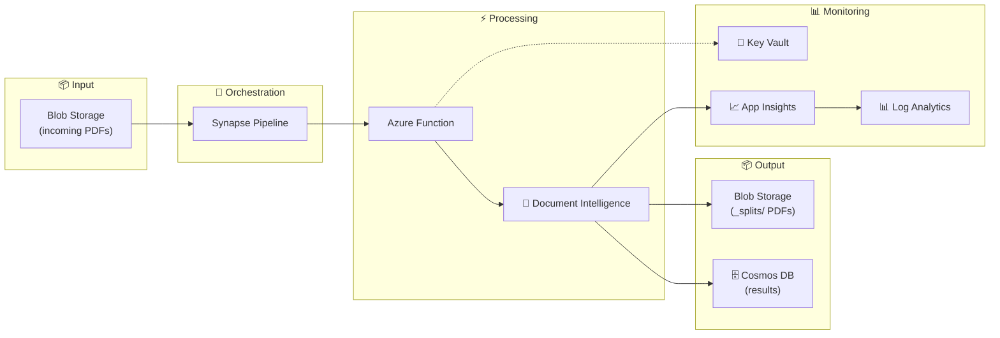

# 📚 Azure Document Intelligence Pipeline Documentation

> **Comprehensive documentation for the PDF processing pipeline**

---

## 🗂️ Documentation Index

### 📖 Guides

| Guide | Description |
|-------|-------------|
| [🚀 Getting Started](./guides/getting-started.md) | Quick start guide |
| [🤖 Custom Models Guide](./guides/document-intelligence-custom-models.md) | Building and training custom extraction models |
| [🖥️ Studio Walkthrough](./guides/document-intelligence-studio-walkthrough.md) | Step-by-step Document Intelligence Studio guide |
| [⚙️ Configuration Guide](./guides/configuration.md) | Environment variables and settings |
| [🔧 Troubleshooting](./guides/troubleshooting.md) | Common issues and solutions |

### 🔷 Azure Services

| Service | Documentation |
|---------|---------------|
| [📋 Services Overview](./azure-services/README.md) | All Azure services used in this pipeline |

### 📊 Diagrams

| Diagram | Description |
|---------|-------------|
| [🏗️ Architecture](./diagrams/architecture.excalidraw) | System architecture (Excalidraw source) |

### 📋 Standards

| Document | Description |
|----------|-------------|
| [📝 Documentation Standards](./DOCUMENTATION-STANDARDS.md) | Visual and writing guidelines |

---

## 🎯 Quick Links

### For Developers

- [CLAUDE.md](../CLAUDE.md) - AI assistant instructions and codebase reference
- [API Reference](./api/function-api.md) - Function App HTTP endpoints
- [Configuration](./guides/configuration.md) - Environment variables

### For Operations

- [Deployment Guide](./guides/deployment.md) - Infrastructure deployment
- [Azure Services](./azure-services/README.md) - Service configuration
- [Troubleshooting](./guides/troubleshooting.md) - Common issues

### For Data Scientists

- [Custom Models](./guides/document-intelligence-custom-models.md) - Training custom models
- [Studio Walkthrough](./guides/document-intelligence-studio-walkthrough.md) - Using Document Intelligence Studio

---

## 🏗️ Architecture Overview



### Data Flow

1. **PDF Upload** → Blob Storage `incoming/` folder
2. **Pipeline Trigger** → Synapse discovers new PDFs
3. **Processing** → Function downloads, splits, and analyzes PDFs
4. **Extraction** → Document Intelligence extracts fields
5. **Storage** → Results saved to Cosmos DB, split PDFs to `_splits/`
6. **Monitoring** → Logs sent to Log Analytics and App Insights

---

## 📊 Key Features

| Feature | Description | Status |
|---------|-------------|--------|
| 🔄 Auto PDF Splitting | Splits multi-page PDFs into 2-page forms | ✅ |
| ⚡ Parallel Processing | Processes multiple forms concurrently | ✅ |
| 🤖 Custom Models | Supports trained Document Intelligence models | ✅ |
| 🗄️ Cosmos DB Storage | Stores extracted data with source PDF links | ✅ |
| 📦 PDF Archive | Keeps split PDFs for user review | ✅ |
| 🔐 Managed Identity | Secure authentication without keys | ✅ |
| 📊 Monitoring | Full observability with App Insights | ✅ |

---

## 🚀 Quick Start

### 1. Deploy Infrastructure

```bash
az deployment sub create \
  --location eastus \
  --template-file infra/main.bicep \
  --parameters infra/parameters/dev.bicepparam \
  --parameters sqlAdministratorPassword='YourSecurePassword123!'
```

### 2. Deploy Function Code

```bash
cd src/functions
func azure functionapp publish <function-app-name> --python
```

### 3. Upload a Test PDF

```bash
az storage blob upload \
  --account-name <storage-account> \
  --container-name pdfs \
  --name incoming/test.pdf \
  --file ./test.pdf
```

### 4. Trigger Pipeline

```bash
az synapse pipeline create-run \
  --workspace-name <synapse-workspace> \
  --name ProcessPDFsWithDocIntelligence
```

### 5. Check Results

```bash
# Query Cosmos DB for results
az cosmosdb sql query \
  --account-name <cosmos-account> \
  --database-name DocumentsDB \
  --container-name ExtractedData \
  --query "SELECT * FROM c WHERE c.sourceFile = 'incoming/test.pdf'"
```

---

## 📁 Documentation Structure

```
docs/
├── README.md                              # This file
├── DOCUMENTATION-STANDARDS.md             # Writing guidelines
├── guides/
│   ├── document-intelligence-custom-models.md
│   ├── document-intelligence-studio-walkthrough.md
│   ├── getting-started.md                 # TODO
│   ├── deployment.md                      # TODO
│   ├── configuration.md                   # TODO
│   └── troubleshooting.md                 # TODO
├── azure-services/
│   └── README.md                          # Services overview
├── diagrams/
│   └── architecture.excalidraw            # Architecture diagram
└── api/
    └── function-api.md                    # TODO
```

---

## 🤝 Contributing to Documentation

When adding or updating documentation:

1. Follow [Documentation Standards](./DOCUMENTATION-STANDARDS.md)
2. Use consistent emoji icons for sections
3. Include code examples where applicable
4. Update this index when adding new files
5. Keep diagrams in sync with code changes

---

## 📚 External Resources

- [Azure Document Intelligence Docs](https://learn.microsoft.com/en-us/azure/ai-services/document-intelligence/)
- [Azure Functions Python Guide](https://learn.microsoft.com/en-us/azure/azure-functions/functions-reference-python)
- [Azure Cosmos DB Best Practices](https://learn.microsoft.com/en-us/azure/cosmos-db/nosql/best-practices)
- [Azure Synapse Pipelines](https://learn.microsoft.com/en-us/azure/synapse-analytics/get-started-pipelines)

---

*Last Updated: December 2024*
