# 🔷 Azure Services Documentation

> **Comprehensive guide to all Azure services used in this pipeline**

---

## 📑 Services Overview

| Service | Purpose | Icon |
|---------|---------|------|
| [Azure Functions](#-azure-functions) | PDF processing & API endpoint | ⚡ |
| [Document Intelligence](#-document-intelligence) | AI document extraction | 🤖 |
| [Cosmos DB](#-cosmos-db) | Extracted data storage | 🗄️ |
| [Blob Storage](#-blob-storage) | PDF file storage | 📦 |
| [Key Vault](#-key-vault) | Secrets management | 🔐 |
| [Synapse Analytics](#-synapse-analytics) | Pipeline orchestration | 🔄 |
| [Log Analytics](#-log-analytics) | Centralized logging | 📊 |
| [Application Insights](#-application-insights) | APM & telemetry | 📈 |

---

## ⚡ Azure Functions

### Purpose
HTTP-triggered serverless compute for PDF processing logic.

### Configuration

| Setting | Value | Notes |
|---------|-------|-------|
| Runtime | Python 3.10+ | v2 programming model |
| Functions Version | v4 | Latest runtime |
| Plan | Consumption / Premium | Based on workload |
| Auth Level | Function | Key-based auth |

### Environment Variables

```bash
# Required
DOC_INTEL_ENDPOINT=https://your-resource.cognitiveservices.azure.com
DOC_INTEL_API_KEY=your-api-key
COSMOS_ENDPOINT=https://your-cosmos.documents.azure.com:443
COSMOS_DATABASE=DocumentsDB
COSMOS_CONTAINER=ExtractedData
AzureWebJobsStorage=DefaultEndpointsProtocol=https;AccountName=...

# Optional
SAS_EXPIRY_HOURS=1
MAX_RETRIES=3
RETRY_DELAY_SECONDS=30
```

### SKU Recommendations

| Environment | SKU | Cost/Month | Notes |
|-------------|-----|------------|-------|
| Dev | Consumption | $0-5 | 1M executions free |
| Prod (low) | Consumption | $5-20 | Pay per execution |
| Prod (high) | Premium EP1 | ~$150 | Always warm, VNET |

---

## 🤖 Document Intelligence

### Purpose
AI-powered document extraction using custom trained models.

### Configuration

| Setting | Value |
|---------|-------|
| API Version | 2024-02-29-preview |
| Model Type | Custom Neural |
| Rate Limit | 15 TPS (default) |

### Pricing (as of 2024)

| Tier | Price | Included |
|------|-------|----------|
| Free (F0) | $0 | 500 pages/month |
| Standard (S0) | $1.50/1000 pages | Custom models |

### Key Gotchas

⚠️ **Rate Limiting:** Default 15 TPS - implement exponential backoff

⚠️ **Private Blobs:** Cannot access private storage - use SAS tokens

⚠️ **Long Operations:** Large PDFs can take 30+ seconds

---

## 🗄️ Cosmos DB

### Purpose
NoSQL database for storing extracted document data.

### Configuration

| Setting | Value |
|---------|-------|
| API | NoSQL (Core) |
| Consistency | Session |
| Partition Key | `/sourceFile` |
| Database | DocumentsDB |
| Container | ExtractedData |

### Document Schema

```json
{
  "id": "folder_document_pdf_form1",
  "sourceFile": "folder/document.pdf",
  "processedPdfUrl": "https://storage.blob.../splits/...",
  "processedAt": "2024-01-15T10:30:00Z",
  "formNumber": 1,
  "totalForms": 3,
  "pageRange": "1-2",
  "modelId": "ag-survey-v1",
  "modelConfidence": 0.95,
  "fields": { ... },
  "confidence": { ... }
}
```

### SKU Recommendations

| Environment | Mode | Cost/Month |
|-------------|------|------------|
| Dev | Serverless | $0-5 |
| Prod (low) | Serverless | $5-50 |
| Prod (high) | Autoscale 1000-4000 RU/s | $50-200 |

### Key Gotchas

⚠️ **Partition Key Required:** Must include in every document

⚠️ **Cross-Partition Queries:** Expensive - always filter by partition

⚠️ **Free Tier:** Only 1 per subscription (1000 RU/s + 25 GB)

---

## 📦 Blob Storage

### Purpose
Store incoming PDFs and split PDF chunks.

### Container Structure

```
pdfs/
├── incoming/           # New PDFs to process
│   ├── form1.pdf
│   └── form2.pdf
└── _splits/            # Split PDF chunks (permanent)
    ├── form1_form1_pages1-2.pdf
    └── form1_form2_pages3-4.pdf
```

### Configuration

| Setting | Value |
|---------|-------|
| Performance | Standard |
| Redundancy | LRS (dev) / GRS (prod) |
| Access Tier | Hot |
| Public Access | Disabled |

### SAS Token Generation

```python
# 1-hour expiry with read permission
sas_token = generate_blob_sas(
    account_name=account_name,
    container_name=container_name,
    blob_name=blob_name,
    account_key=account_key,
    permission=BlobSasPermissions(read=True),
    expiry=datetime.utcnow() + timedelta(hours=1)
)
```

---

## 🔐 Key Vault

### Purpose
Secure storage for API keys and connection strings.

### Secrets Stored

| Secret Name | Purpose |
|-------------|---------|
| `DocIntelApiKey` | Document Intelligence API key |
| `FunctionAppHostKey` | Function host key for Synapse |
| `CosmosConnectionString` | Cosmos DB connection (optional) |

### Access Configuration

| Principal | Role | Purpose |
|-----------|------|---------|
| Function App MI | Key Vault Secrets User | Read API keys |
| Synapse MI | Key Vault Secrets User | Read function key |
| Developers | Key Vault Administrator | Manage secrets |

⚠️ **Important:** Use `Key Vault Secrets User`, NOT `Key Vault Reader`

---

## 🔄 Synapse Analytics

### Purpose
Orchestrate batch PDF processing with pipelines.

### Pipeline: ProcessPDFsWithDocIntelligence

```mermaid
flowchart LR
    GetMetadata["📋 GetMetadata<br/>(list files)"] --> FilterPDFs["🔍 Filter PDFs<br/>(*.pdf only)"]
    FilterPDFs --> ForEach["🔄 ForEach PDF<br/>(call Function)"]

    style GetMetadata fill:#ede9fe,stroke:#7C3AED
    style FilterPDFs fill:#ede9fe,stroke:#7C3AED
    style ForEach fill:#ede9fe,stroke:#7C3AED
```



### Configuration

| Setting | Value | Notes |
|---------|-------|-------|
| Batch Count | 3 | Reduced from 10 to avoid rate limits |
| Activity Timeout | 10 minutes | For large PDFs |
| Retry Count | 2 | On transient failures |

### Artifact Folders

```
src/synapse/
├── pipeline/           # Pipeline definitions (singular!)
├── linkedService/      # Linked services (singular!)
├── dataset/            # Datasets (singular!)
├── notebook/           # Notebooks (singular!)
└── sqlscript/          # SQL scripts (singular!)
```

⚠️ **Critical:** Folder names MUST be singular!

---

## 📊 Log Analytics

### Purpose
Centralized logging and monitoring workspace.

### Data Sources

| Source | Data Type |
|--------|-----------|
| Function App | AppTraces, AppRequests, AppExceptions |
| Cosmos DB | CDBDataPlaneRequests |
| Synapse | SynapseIntegrationPipelineRuns |

### Useful KQL Queries

```kusto
// Failed function invocations
AppRequests
| where Success == false
| where TimeGenerated > ago(24h)
| summarize count() by ResultCode, bin(TimeGenerated, 1h)

// Document processing latency
AppRequests
| where Name == "process"
| summarize avg(DurationMs), percentile(DurationMs, 95) by bin(TimeGenerated, 1h)
```

### Retention

| Environment | Retention | Cost Impact |
|-------------|-----------|-------------|
| Dev | 30 days | Free tier |
| Prod | 90 days | ~$2.30/GB |

---

## 📈 Application Insights

### Purpose
Application Performance Monitoring for the Function App.

### Tracked Metrics

| Metric | Description |
|--------|-------------|
| Request duration | Processing time per document |
| Failure rate | % of failed extractions |
| Dependency calls | Doc Intel, Cosmos, Blob latency |
| Custom events | PDF splits, form counts |

### Sampling Configuration

```python
# Reduce telemetry volume in production
APPLICATIONINSIGHTS_SAMPLING_PERCENTAGE=20
```

⚠️ **Cost Tip:** Enable sampling to reduce ingestion costs by 70-90%

---

## 🔗 Service Connections

### Authentication Flow

```mermaid
flowchart LR
    subgraph Auth["🔐 Authentication Architecture"]
        Synapse["🔄 Synapse"] -->|Function Key from KV| FuncApp["⚡ Function App"]
        FuncApp -->|Managed Identity| Cosmos["🗄️ Cosmos DB"]
        FuncApp -->|API Key from KV| DocIntel["🤖 Doc Intel"]
        FuncApp -->|Connection String| Blob["📦 Blob Storage"]

        AllServices["All Services"] -->|Managed Identity| LogAnalytics["📊 Log Analytics"]
    end

    style Synapse fill:#ede9fe,stroke:#7C3AED
    style FuncApp fill:#fef3c7,stroke:#F59E0B
    style Cosmos fill:#d1fae5,stroke:#059669
    style DocIntel fill:#fee2e2,stroke:#DC2626
    style Blob fill:#deebff,stroke:#0078D4
    style LogAnalytics fill:#e0f2fe,stroke:#0EA5E9
```



### Required RBAC Roles

| Service | Identity | Role |
|---------|----------|------|
| Blob Storage | Function App MI | Storage Blob Data Contributor |
| Cosmos DB | Function App MI | Cosmos DB Built-in Data Contributor |
| Key Vault | Function App MI | Key Vault Secrets User |
| Key Vault | Synapse MI | Key Vault Secrets User |

---

## 💰 Cost Estimates

### Development Environment

| Service | SKU | Monthly Cost |
|---------|-----|-------------|
| Function App | Consumption | $0-5 |
| Document Intelligence | F0 | $0 |
| Cosmos DB | Serverless | $0-5 |
| Blob Storage | Standard LRS | $1-5 |
| Key Vault | Standard | $0.03/secret |
| Synapse | Serverless | $5/TB queried |
| Log Analytics | Pay-as-you-go | $0-5 |
| **Total** | | **$7-25** |

### Production Environment

| Service | SKU | Monthly Cost |
|---------|-----|-------------|
| Function App | Premium EP1 | $150 |
| Document Intelligence | S0 | $45 (30K pages) |
| Cosmos DB | Autoscale 1000 RU/s | $50-100 |
| Blob Storage | Standard GRS | $10-50 |
| Key Vault | Standard | $1-5 |
| Synapse | Basic | $100-200 |
| Log Analytics | Commitment 100GB | $100 |
| **Total** | | **$450-650** |

---

## 📚 Additional Resources

- [Azure Functions Python Guide](https://learn.microsoft.com/en-us/azure/azure-functions/functions-reference-python)
- [Document Intelligence Documentation](https://learn.microsoft.com/en-us/azure/ai-services/document-intelligence/)
- [Cosmos DB Best Practices](https://learn.microsoft.com/en-us/azure/cosmos-db/nosql/best-practices)
- [Synapse Pipeline Guide](https://learn.microsoft.com/en-us/azure/synapse-analytics/get-started-pipelines)
- [Azure Pricing Calculator](https://azure.microsoft.com/en-us/pricing/calculator/)

---

*Last Updated: December 2024*
