# 🔍 Detailed Architecture

> **Comprehensive Azure architecture diagram with all components, data flows, security layers, and monitoring infrastructure**

---

## 📊 Architecture Diagram


---

## 🎯 Overview

This detailed architecture diagram provides a comprehensive view of all Azure components, their interactions, security boundaries, and monitoring infrastructure. Use this diagram to understand:

- Complete component inventory
- Data flow paths
- Security boundaries and authentication methods
- Monitoring and logging infrastructure
- Deployment topology

---

## 🏢 Azure Components

### 📦 Storage Layer

| Component | Azure Service | SKU/Tier | Purpose |
|-----------|---------------|----------|---------|
| **Primary Storage** | Azure Blob Storage | Standard LRS | PDF storage (incoming, splits, dead-letter) |
| **Analytical Storage** | ADLS Gen2 | Standard LRS | Delta Lake medallion architecture (optional) |

**Storage Containers:**

```
Storage Account
├── pdfs/                       # Primary container
│   ├── incoming/               # Upload location (trigger source)
│   ├── _splits/                # Processed 2-page PDFs
│   └── dead-letter/            # Failed documents
└── delta/                      # Analytical data (optional)
    ├── bronze/                 # Raw Cosmos DB extracts
    └── silver/                 # Cleaned, partitioned data
```

### 🤖 AI Services

| Component | Azure Service | API Version | Purpose |
|-----------|---------------|-------------|---------|
| **Document Intelligence** | Cognitive Services | 2024-02-29-preview | Field extraction from PDFs |

**Supported Models:**
- `prebuilt-layout` - General document structure
- `prebuilt-invoice` - Invoice processing
- `prebuilt-receipt` - Receipt processing
- Custom models - Trained for specific form types

**Rate Limiting:**
- Default: 15 TPS (transactions per second)
- Exponential backoff with jitter on 429 errors
- Configurable concurrent requests (default: 3)

### ⚡ Compute Layer

| Component | Azure Service | Plan | Purpose |
|-----------|---------------|------|---------|
| **Function App** | Azure Functions | Consumption/Premium | PDF processing logic |
| **App Service Plan** | App Service | Y1/B1/S1/EP1 | Hosting for Function App |

**Function Triggers:**
| Trigger | Path/Route | Description |
|---------|------------|-------------|
| HTTP | `/api/process` | On-demand PDF processing |
| HTTP | `/api/status/{blob_name}` | Status queries |
| HTTP | `/api/health` | Health checks |
| HTTP | `/api/reprocess/{blob_name}` | Retry failed documents |
| Blob | `pdfs/incoming/{name}` | Auto-processing on upload |

### 🔄 Orchestration Layer

| Component | Azure Service | Purpose |
|-----------|---------------|---------|
| **Synapse Workspace** | Azure Synapse Analytics | Pipeline orchestration |
| **Spark Pools** | Synapse Spark | Analytics notebooks (optional) |
| **SQL Serverless** | Synapse SQL | Ad-hoc queries (optional) |

**Pipeline Components:**
```
Pipeline: ProcessPDFsWithDocIntelligence
├── Get Metadata (List blobs)
├── ForEach (Parallel: batchCount=3)
│   └── Web Activity (Call Function App)
└── Error Handling (Dead letter)
```

### 🗄️ Data Layer

| Component | Azure Service | API | Purpose |
|-----------|---------------|-----|---------|
| **Cosmos DB** | Azure Cosmos DB | NoSQL | Extracted document storage |
| **Analytical Store** | Cosmos DB HTAP | Synapse Link | Real-time analytics |

**Database Structure:**
```
Cosmos DB Account
└── DocumentsDB/                    # Database
    └── ExtractedDocuments/         # Container
        ├── Partition Key: /sourceFile
        ├── Indexing: Automatic
        └── Analytical Store: Enabled (optional)
```

---

## 🔐 Security Architecture

### Identity and Access

```mermaid
flowchart TB
    subgraph Security["Security Perimeter"]
        MI["🆔 Managed Identity<br/>(Functions)"]
        KV["🔑 Key Vault<br/>(Secrets)"]
        RBAC["🛡️ RBAC Roles<br/>(Access)"]

        MI --> SC
        KV --> SC
        RBAC --> SC

        subgraph SC["Service Connections"]
            S1["Storage: MI or Connection String"]
            S2["Cosmos DB: MI or Key"]
            S3["Doc Intel: API Key (from Key Vault)"]
            S4["Synapse: MI"]
        end
    end
```



### Authentication Methods

| Service Connection | Method | Notes |
|-------------------|--------|-------|
| Function → Storage | Managed Identity | Preferred |
| Function → Cosmos DB | Managed Identity | Preferred |
| Function → Doc Intel | API Key (Key Vault) | MI not supported |
| Function → Key Vault | Managed Identity | For secret retrieval |
| Synapse → Function | Function Key (Key Vault) | Stored as `FunctionAppHostKey` |
| Synapse → Storage | Managed Identity | Workspace identity |
| Synapse → Key Vault | Managed Identity | For Function key |

### Key Vault Secrets

| Secret Name | Purpose | Used By |
|-------------|---------|---------|
| `DOC-INTEL-API-KEY` | Document Intelligence API key | Function App |
| `FunctionAppHostKey` | Function App host key | Synapse Pipeline |
| `STORAGE-CONNECTION-STRING` | Storage connection (backup) | Function App |

### SAS Token Generation

```mermaid
flowchart LR
    FA["⚡ Function App"] --> GEN["🔐 Generate SAS Token"]
    GEN --> DI["🤖 Doc Intel API"]
    GEN --> TP["📋 Token Properties"]

    TP --> P1["• Read permission"]
    TP --> P2["• 1-hour expiry"]
    TP --> P3["• HTTPS only"]
```



---

## 📊 Monitoring Infrastructure

### Telemetry Flow

```mermaid
flowchart TB
    subgraph Resources["Azure Resources"]
        ST["📦 Storage"]
        FN["⚡ Functions"]
        CO["🗄️ Cosmos"]
        DI["🤖 Doc Intel"]
        SY["🔄 Synapse"]
    end

    Resources --> DS["⚙️ Diagnostic Settings"]
    DS --> LA["📊 Log Analytics Workspace"]

    LA --> |"Resource Logs"| AI["📈 Application Insights"]
    LA --> |"Metrics"| WB["📋 Azure Workbooks"]
    LA --> |"Custom Telemetry"| AL["🚨 Alerts & Dashboards"]
```



### Diagnostic Categories

| Resource | Log Categories | Metrics |
|----------|---------------|---------|
| **Storage** | StorageBlobLogs | Transaction, Capacity |
| **Functions** | FunctionAppLogs | Requests, Errors, Duration |
| **Cosmos DB** | DataPlaneRequests, QueryRuntimeStatistics | RequestUnits |
| **Doc Intel** | Audit, RequestResponse, Trace | SuccessfulCalls, Latency |
| **Key Vault** | AuditEvent | ServiceApiHit, ServiceApiLatency |
| **Synapse** | IntegrationPipelineRuns, IntegrationActivityRuns | - |

### Custom Metrics (Application Insights)

| Metric | Type | Dimensions |
|--------|------|------------|
| `forms_processed` | Counter | model_id, status |
| `processing_duration_ms` | Gauge | model_id |
| `retry_count` | Counter | source_file |
| `dead_letter_count` | Counter | error_type |

---

## 🔄 Processing Workflows

### Standard Processing Flow

```mermaid
flowchart LR
    UP["📤 Upload PDF"] --> TR["🔔 Trigger<br/>(Blob/HTTP)"]
    TR --> SP["✂️ Split PDF"]
    SP --> EX["🤖 Extract Fields"]
    EX --> ST["💾 Store Results"]

    SP --> AR["📦 Archive Split"]
    EX --> WH["🔔 Webhook Notify"]
```



### Retry and Dead Letter Flow

```mermaid
flowchart TB
    PF["❌ Process Failed"] --> RC{"🔄 Retry < Max?"}
    RC -->|Yes| RP["♻️ Reprocess"]
    RC -->|No| DL["📭 Move to Dead Letter"]
    DL --> WH["🔔 Send Webhook"]
    WH --> AI["📊 Log to App Insights"]
```



### Batch Processing (Synapse Pipeline)

```mermaid
flowchart TB
    subgraph Pipeline["🔄 Synapse Pipeline"]
        GM["📋 Get Metadata<br/>(List Blobs)"] --> FI["🔍 Filter<br/>(*.pdf)"]
        FI --> FE["🔁 ForEach<br/>(Batch: 3)"]

        FE --> W1["🌐 Web Call (PDF 1)"]
        FE --> W2["🌐 Web Call (PDF 2)"]
        FE --> W3["🌐 Web Call (PDF 3)"]
    end
```



---

## 🌐 Network Architecture

### Default Configuration (Public Endpoints)

```mermaid
flowchart TB
    INT["🌐 Internet"]

    INT --> PE["Public Endpoints"]

    PE --> FA["⚡ Function App<br/>*.azurewebsites.net"]
    PE --> CD["🗄️ Cosmos DB<br/>*.documents.azure.com"]
    PE --> ST["📦 Storage<br/>*.blob.core.windows.net"]
```



### Enterprise Configuration (Private Endpoints - Optional)

```mermaid
flowchart TB
    subgraph VNet["🔒 Virtual Network"]
        subgraph S1["Subnet 1 (Functions)"]
            FA["⚡ Functions"]
        end

        subgraph S2["Subnet 2 (Private Endpoints)"]
            PE1["📦 Storage PE"]
            PE2["🗄️ Cosmos PE"]
            PE3["🔑 Key Vault PE"]
            PE4["🤖 Doc Intel PE"]
        end

        subgraph S3["Subnet 3 (Synapse)"]
            SY["🔄 Synapse"]
        end

        FA -.-> S2
        SY -.-> S2
    end
```



---

## 📦 Deployment Topology

### Resource Group Layout

```mermaid
flowchart TB
    subgraph Sub["☁️ Azure Subscription"]
        subgraph RG["📁 rg-docprocessing-dev"]
            ST["📦 Storage"]
            FN["⚡ Functions"]
            CO["🗄️ Cosmos"]
            DI["🤖 Doc Intel"]
            KV["🔑 Key Vault"]
            SY["🔄 Synapse"]
            LA["📊 Log Analytics"]
        end
    end
```



### Cross-Resource-Group Deployment

```mermaid
flowchart TB
    subgraph Sub["☁️ Azure Subscription"]
        subgraph RG1["📁 rg-shared-data"]
            ST["📦 Storage"]
            CO["🗄️ Cosmos DB"]
        end

        subgraph RG2["📁 rg-ai-services"]
            DI["🤖 Doc Intel"]
        end

        subgraph RG3["📁 rg-functions-dev"]
            FN["⚡ Function App"]
        end

        subgraph RG4["📁 rg-security"]
            KV["🔑 Key Vault"]
        end

        FN -.-> ST
        FN -.-> CO
        FN -.-> DI
        FN -.-> KV
    end
```



---

## 📋 Configuration Summary

### Environment Variables

| Category | Variable | Required | Default |
|----------|----------|----------|---------|
| **Document Intelligence** | `DOC_INTEL_ENDPOINT` | Yes | - |
| | `DOC_INTEL_API_KEY` | Yes | - |
| **Cosmos DB** | `COSMOS_ENDPOINT` | Yes | - |
| | `COSMOS_DATABASE` | Yes | - |
| | `COSMOS_CONTAINER` | Yes | - |
| **Processing** | `MAX_CONCURRENT_REQUESTS` | No | `10` |
| | `DEFAULT_MODEL_ID` | No | `prebuilt-layout` |
| | `FUNCTION_TIMEOUT` | No | `230` |
| **Dead Letter** | `DEAD_LETTER_CONTAINER` | No | `dead-letter` |
| | `MAX_RETRY_ATTEMPTS` | No | `3` |
| **Webhook** | `WEBHOOK_URL` | No | - |
| **Monitoring** | `APPINSIGHTS_INSTRUMENTATIONKEY` | No | - |

### Bicep Parameters

| Parameter | New Mode | Existing Mode |
|-----------|----------|---------------|
| `deploymentMode` | `new` | `existing` |
| `resourceGroupName` | New RG name | Target RG |
| `existingStorageAccountName` | - | Storage name |
| `existingCosmosAccountName` | - | Cosmos name |
| `existingDocIntelName` | - | Doc Intel name |
| `existingKeyVaultName` | - | Key Vault name |
| `deployFunctionApp` | - | `true/false` |

---

## 🔗 Related Documentation

| Document | Description |
|----------|-------------|
| [📋 Full Documentation](../README.md) | Complete documentation index |
| [🏗️ Architecture Overview](./architecture-overview.md) | High-level system view |
| [🔷 Azure Services](../azure-services/README.md) | Service-specific documentation |
| [🚀 Deployment Guide](../guides/deployment.md) | Deployment instructions |
| [⚙️ Configuration Guide](../guides/configuration.md) | Settings reference |
| [🔧 Troubleshooting](../guides/troubleshooting.md) | Common issues and solutions |

---

## 📐 Source Files

| File | Format | Description |
|------|--------|-------------|
| [architecture-detailed.excalidraw](./architecture-detailed.excalidraw) | Excalidraw | Editable source diagram |
| [FormExtraction_docs_diagrams_architecture-detailed.svg](./FormExtraction_docs_diagrams_architecture-detailed.svg) | SVG | Exported vector graphic |

> 💡 **Tip:** Open `.excalidraw` files in [Excalidraw](https://excalidraw.com/) or the VS Code Excalidraw extension for editing. Use the SVG file for documentation and presentations.

---

*Last Updated: December 2024*
