# 🏗️ Architecture Overview

> **High-level system architecture for the Azure Document Intelligence PDF Processing Pipeline**

---

## 📊 Architecture Diagram


---

## 🎯 System Overview

The Azure Document Intelligence PDF Processing Pipeline is an end-to-end solution for automated document extraction from PDF files. This architecture diagram illustrates the primary components and data flow through the system.

### Core Components

| Component | Azure Service | Purpose |
|-----------|---------------|---------|
| **📦 Input Storage** | Azure Blob Storage | Receives incoming PDFs in `incoming/` folder |
| **🔄 Orchestration** | Azure Synapse Analytics | Discovers PDFs and triggers processing pipelines |
| **⚡ Processing** | Azure Functions | PDF splitting, parallel extraction coordination |
| **🤖 AI Extraction** | Azure Document Intelligence | Extracts fields using custom or prebuilt models |
| **🗄️ Data Store** | Azure Cosmos DB | Stores extracted data with source PDF links |
| **🔐 Secrets** | Azure Key Vault | Manages API keys and connection strings |
| **📊 Monitoring** | Application Insights + Log Analytics | Centralized logging and observability |

---

## 📈 Data Flow

The architecture follows a linear data flow with parallel processing capabilities:

```mermaid
flowchart LR
    UP["📤 Upload PDF<br/>Blob Storage"] --> DI["🔍 Discover Files<br/>Synapse Analytics"]
    DI --> SP["⚡ Split & Process<br/>Functions"]
    SP --> EX["🤖 Extract Data<br/>Doc Intel"]
    EX --> ST["💾 Store Results<br/>Cosmos DB"]
```



### Step-by-Step Flow

| Step | Action | Component | Description |
|------|--------|-----------|-------------|
| **1** | 📤 Upload | Blob Storage | PDFs uploaded to `incoming/` folder |
| **2** | 🔍 Discover | Synapse Pipeline | Lists blobs and triggers processing |
| **3** | ✂️ Split | Azure Function | Multi-page PDFs split into 2-page forms |
| **4** | 📦 Archive | Blob Storage | Split PDFs stored in `_splits/` folder |
| **5** | 🤖 Extract | Document Intelligence | Fields extracted (3 concurrent calls) |
| **6** | 💾 Store | Cosmos DB | Results saved with PDF source links |
| **7** | 📊 Monitor | App Insights | Metrics and logs captured |

---

## 🔌 Integration Points

### HTTP Endpoints (Azure Functions)

| Endpoint | Method | Purpose |
|----------|--------|---------|
| `/api/process` | POST | Process a single PDF document |
| `/api/status/{blob_name}` | GET | Get processing status |
| `/api/health` | GET | Service health check |
| `/api/reprocess/{blob_name}` | POST | Retry failed document |

### Blob Trigger

| Path | Trigger | Behavior |
|------|---------|----------|
| `pdfs/incoming/{name}` | Auto | Automatically processes uploaded PDFs |

---

## 🔐 Security Architecture

| Security Feature | Description |
|------------------|-------------|
| **🔑 Key Vault** | Stores API keys, secrets |
| **🆔 Managed Identity** | Service-to-service auth |
| **🎫 SAS Tokens** | Time-limited blob access |
| **🛡️ RBAC** | Role-based access control |

**Key Security Features:**
- **Managed Identity** - Preferred authentication between Azure services
- **Key Vault** - Centralized secret management
- **SAS Tokens** - Short-lived tokens for blob access (Document Intelligence)
- **RBAC** - Least-privilege access for all service principals

---

## 📦 Storage Organization

```
pdfs/                           # Main container
├── incoming/                   # Upload location (monitored)
│   ├── document1.pdf
│   └── batch/
│       └── document2.pdf
├── _splits/                    # Processed PDFs (2-page forms)
│   ├── document1_form1_pages1-2.pdf
│   ├── document1_form2_pages3-4.pdf
│   └── batch/
│       └── document2_form1_pages1-2.pdf
└── dead-letter/                # Failed documents (after max retries)
    └── failed_document.pdf
```

---

## 🗄️ Cosmos DB Schema

Each extracted form creates a document in Cosmos DB:

```json
{
  "id": "folder_document_pdf_form1",
  "sourceFile": "folder/document.pdf",    // Partition key
  "processedPdfUrl": "https://.../_splits/document_form1.pdf?sas=...",
  "formNumber": 1,
  "totalForms": 3,
  "pageRange": "1-2",
  "fields": { "vendorName": "Acme", "total": 1500 },
  "confidence": { "vendorName": 0.98, "total": 0.95 },
  "status": "completed"
}
```

**Key Schema Properties:**
- `sourceFile` is the **partition key** for efficient querying
- Each form in a multi-page PDF gets its own document
- `processedPdfUrl` provides direct access to the split PDF

---

## ⚡ Performance Characteristics

| Metric | Value | Notes |
|--------|-------|-------|
| **Concurrency** | 3 parallel | Document Intelligence calls |
| **Rate Limit** | 15 TPS | Default Document Intelligence limit |
| **PDF Processing** | 10-60 seconds | Depends on page count and model |
| **Retry Attempts** | 3 max | Before moving to dead letter |
| **Function Timeout** | 230 seconds | Configurable |

---

## 📊 Monitoring Points

| Component | Logs Collected | Metrics |
|-----------|---------------|---------|
| **Storage** | Blob operations | Transactions, capacity |
| **Functions** | Execution logs, errors | Duration, invocations |
| **Document Intelligence** | API requests, traces | Request count, latency |
| **Cosmos DB** | Data plane requests | RU consumption, latency |
| **Key Vault** | Audit events | Access patterns |

---

## 🔗 Related Documentation

| Document | Description |
|----------|-------------|
| [📋 Full Documentation](../README.md) | Complete documentation index |
| [🔍 Detailed Architecture](./architecture-detailed.md) | Comprehensive component details |
| [🔷 Azure Services](../azure-services/README.md) | Service-specific documentation |
| [⚙️ Configuration Guide](../guides/configuration.md) | Environment variables and settings |

---

## 📐 Source Files

| File | Format | Description |
|------|--------|-------------|
| [architecture.excalidraw](./architecture.excalidraw) | Excalidraw | Editable source diagram |
| [FormExtraction_docs_diagrams_architecture.svg](./FormExtraction_docs_diagrams_architecture.svg) | SVG | Exported vector graphic |

> 💡 **Tip:** Open `.excalidraw` files in [Excalidraw](https://excalidraw.com/) or the VS Code Excalidraw extension for editing.

---

*Last Updated: December 2024*
