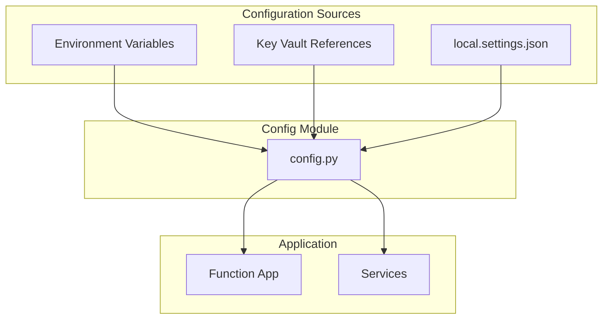

# ⚙️ Configuration Guide

> **Complete reference for environment variables and application settings**

---

## 📑 Table of Contents

- [Overview](#-overview)
- [Required Settings](#-required-settings)
- [Optional Settings](#-optional-settings)
- [Local Development](#-local-development)
- [Azure Configuration](#-azure-configuration)
- [Security Best Practices](#-security-best-practices)

---

## 🎯 Overview

The pipeline uses environment variables for configuration. In Azure Functions, these are managed through Application Settings.

### Configuration Hierarchy



---

## 📋 Required Settings

These environment variables must be set for the application to start.

### Document Intelligence

| Variable | Description | Example |
|----------|-------------|---------|
| `DOC_INTEL_ENDPOINT` | Document Intelligence endpoint URL | `https://docproc-dev.cognitiveservices.azure.com` |
| `DOC_INTEL_API_KEY` | API key (or Key Vault reference) | `@Microsoft.KeyVault(...)` |

### Cosmos DB

| Variable | Description | Example |
|----------|-------------|---------|
| `COSMOS_ENDPOINT` | Cosmos DB endpoint URL | `https://docproc-cosmos-dev.documents.azure.com:443/` |
| `COSMOS_DATABASE` | Database name | `DocumentsDB` |
| `COSMOS_CONTAINER` | Container name | `ExtractedData` |

### Storage

| Variable | Description | Example |
|----------|-------------|---------|
| `AzureWebJobsStorage` | Storage connection string | `DefaultEndpointsProtocol=https;...` |

---

## 🔧 Optional Settings

These settings have default values but can be customized.

### Processing Settings

| Variable | Default | Description |
|----------|---------|-------------|
| `DEFAULT_MODEL_ID` | `prebuilt-layout` | Default Document Intelligence model |
| `MAX_CONCURRENT_REQUESTS` | `10` | Max parallel Document Intelligence calls |
| `FUNCTION_TIMEOUT` | `230` | Function timeout in seconds |
| `SAS_TOKEN_EXPIRY_HOURS` | `1` | SAS token lifetime for blob access |

### Dead Letter Settings

| Variable | Default | Description |
|----------|---------|-------------|
| `DEAD_LETTER_CONTAINER` | `_dead_letter` | Container for failed documents |
| `MAX_RETRY_ATTEMPTS` | `3` | Max retries before dead letter |

### Webhook Settings

| Variable | Default | Description |
|----------|---------|-------------|
| `WEBHOOK_URL` | `null` | Default webhook URL for notifications |

### Logging Settings

| Variable | Default | Description |
|----------|---------|-------------|
| `LOG_LEVEL` | `INFO` | Log level (DEBUG, INFO, WARNING, ERROR) |
| `LOG_FORMAT` | `auto` | Log format (`auto`, `json`, `text`) |

### Key Vault (Optional)

| Variable | Default | Description |
|----------|---------|-------------|
| `KEY_VAULT_NAME` | `null` | Key Vault name for secrets |

---

## 💻 Local Development

### local.settings.json Template

```json
{
  "IsEncrypted": false,
  "Values": {
    "FUNCTIONS_WORKER_RUNTIME": "python",
    "AzureWebJobsStorage": "UseDevelopmentStorage=true",

    "DOC_INTEL_ENDPOINT": "https://your-resource.cognitiveservices.azure.com",
    "DOC_INTEL_API_KEY": "your-api-key-here",

    "COSMOS_ENDPOINT": "https://your-cosmos.documents.azure.com:443/",
    "COSMOS_DATABASE": "DocumentsDB",
    "COSMOS_CONTAINER": "ExtractedData",

    "DEFAULT_MODEL_ID": "prebuilt-layout",
    "MAX_CONCURRENT_REQUESTS": "3",
    "LOG_LEVEL": "DEBUG",

    "WEBHOOK_URL": "http://localhost:8080/webhook"
  },
  "Host": {
    "CORS": "*"
  }
}
```

### Using Azurite for Local Storage

```json
{
  "Values": {
    "AzureWebJobsStorage": "UseDevelopmentStorage=true"
  }
}
```

Or with explicit connection:

```json
{
  "Values": {
    "AzureWebJobsStorage": "DefaultEndpointsProtocol=http;AccountName=devstoreaccount1;AccountKey=Eby8vdM02xNOcqFlqUwJPLlmEtlCDXJ1OUzFT50uSRZ6IFsuFq2UVErCz4I6tq/K1SZFPTOtr/KBHBeksoGMGw==;BlobEndpoint=http://127.0.0.1:10000/devstoreaccount1"
  }
}
```

---

## ☁️ Azure Configuration

### Setting Application Settings via CLI

```bash
# Set individual setting
az functionapp config appsettings set \
  --name <function-app-name> \
  --resource-group <resource-group> \
  --settings "DOC_INTEL_ENDPOINT=https://..."

# Set multiple settings from file
az functionapp config appsettings set \
  --name <function-app-name> \
  --resource-group <resource-group> \
  --settings @settings.json
```

### Using Key Vault References

For sensitive values, use Key Vault references:

```json
{
  "DOC_INTEL_API_KEY": "@Microsoft.KeyVault(VaultName=my-keyvault;SecretName=DocIntelKey)"
}
```

**Required Setup:**
1. Enable system-assigned managed identity on Function App
2. Grant `Key Vault Secrets User` role to the identity
3. Use the Key Vault reference syntax above

### Bicep Configuration

Settings are automatically configured via Bicep deployment:

```bicep
resource functionApp 'Microsoft.Web/sites@2022-09-01' = {
  name: functionAppName
  properties: {
    siteConfig: {
      appSettings: [
        {
          name: 'DOC_INTEL_ENDPOINT'
          value: docIntelEndpoint
        }
        {
          name: 'DOC_INTEL_API_KEY'
          value: '@Microsoft.KeyVault(VaultName=${keyVaultName};SecretName=DocIntelKey)'
        }
        // ... more settings
      ]
    }
  }
}
```

---

## 🔒 Security Best Practices

### Do's ✅

| Practice | Description |
|----------|-------------|
| Use Key Vault | Store all secrets in Key Vault |
| Use Managed Identity | Authenticate to Azure services without keys |
| Rotate keys regularly | Set up key rotation schedules |
| Use RBAC | Grant minimum required permissions |
| Encrypt at rest | Enable encryption for storage and Cosmos DB |

### Don'ts ❌

| Practice | Risk |
|----------|------|
| Commit `local.settings.json` | Exposes secrets in source control |
| Use connection strings in code | Secrets visible in code |
| Share API keys | Difficult to revoke access |
| Disable HTTPS | Data exposed in transit |

### .gitignore Configuration

```gitignore
# Local settings (contains secrets)
local.settings.json

# Python
.venv/
__pycache__/
*.pyc

# IDE
.vscode/
.idea/
```

### Key Vault Secret Rotation

```bash
# Create new version of secret
az keyvault secret set \
  --vault-name <keyvault-name> \
  --name DocIntelKey \
  --value "new-api-key"

# Function App automatically picks up new version
# (may take a few minutes)
```

---

## 📊 Configuration Reference Table

| Variable | Required | Default | Key Vault | Description |
|----------|----------|---------|-----------|-------------|
| `DOC_INTEL_ENDPOINT` | Yes | - | No | Document Intelligence endpoint |
| `DOC_INTEL_API_KEY` | Yes* | - | Yes | Document Intelligence API key |
| `COSMOS_ENDPOINT` | Yes | - | No | Cosmos DB endpoint |
| `COSMOS_DATABASE` | Yes | - | No | Cosmos DB database name |
| `COSMOS_CONTAINER` | Yes | - | No | Cosmos DB container name |
| `AzureWebJobsStorage` | Yes | - | Yes | Storage connection string |
| `DEFAULT_MODEL_ID` | No | `prebuilt-layout` | No | Default model ID |
| `MAX_CONCURRENT_REQUESTS` | No | `10` | No | Max parallel requests |
| `FUNCTION_TIMEOUT` | No | `230` | No | Function timeout (seconds) |
| `SAS_TOKEN_EXPIRY_HOURS` | No | `1` | No | SAS token lifetime |
| `DEAD_LETTER_CONTAINER` | No | `_dead_letter` | No | Dead letter container |
| `MAX_RETRY_ATTEMPTS` | No | `3` | No | Max retry count |
| `WEBHOOK_URL` | No | `null` | No | Default webhook URL |
| `LOG_LEVEL` | No | `INFO` | No | Logging level |
| `KEY_VAULT_NAME` | No | `null` | No | Key Vault name |

*Can use Managed Identity instead of API key

---

## 🔍 Troubleshooting Configuration Issues

### Common Issues

| Issue | Cause | Solution |
|-------|-------|----------|
| `ConfigurationError: Missing DOC_INTEL_ENDPOINT` | Variable not set | Add to app settings or local.settings.json |
| Key Vault access denied | Missing RBAC | Grant `Key Vault Secrets User` role |
| Connection timeout | Wrong endpoint | Verify endpoint URL format |
| Invalid API key | Key rotated | Update Key Vault secret |

### Validate Configuration

```bash
# Check if all required settings are present
az functionapp config appsettings list \
  --name <function-app-name> \
  --resource-group <resource-group> \
  --query "[?name=='DOC_INTEL_ENDPOINT' || name=='COSMOS_ENDPOINT'].{name:name, value:value}"
```

### View Configuration in Portal

1. Navigate to Function App in Azure Portal
2. Go to **Settings** → **Configuration**
3. View **Application settings** tab

---

*Last Updated: December 2024*
