# 🚀 Deployment Guide

> **Complete deployment instructions for all environments**

---

## 📑 Table of Contents

- [Deployment Overview](#-deployment-overview)
- [Deployment Modes](#-deployment-modes)
- [Prerequisites](#-prerequisites)
- [Infrastructure Deployment](#-infrastructure-deployment)
- [Function App Deployment](#-function-app-deployment)
- [Synapse Artifacts](#-synapse-artifacts)
- [Post-Deployment](#-post-deployment)
- [CI/CD Pipeline](#-cicd-pipeline)

---

## 🎯 Deployment Overview

```mermaid
flowchart TB
    subgraph Infra["1️⃣ Infrastructure"]
        Bicep["Bicep Templates"]
    end

    subgraph Code["2️⃣ Application Code"]
        Functions["Azure Functions"]
    end

    subgraph Artifacts["3️⃣ Synapse Artifacts"]
        Pipelines["Pipelines"]
        LinkedServices["Linked Services"]
    end

    Bicep --> Code
    Code --> Artifacts
```



---

## 📋 Deployment Modes

| Mode | Use Case | Parameter File |
|------|----------|----------------|
| `new` | Fresh deployment of all resources | `dev.bicepparam` or `prod.bicepparam` |
| `existing` | Use existing backend, deploy new Function App | `existing.bicepparam` |

### Mode: New Deployment

Creates all resources from scratch:
- Storage Account
- Document Intelligence
- Cosmos DB
- Synapse Workspace
- Function App
- Key Vault
- Log Analytics

### Mode: Existing Resources

Use existing backend resources (useful for multi-tenant or shared infrastructure):
- Connects to existing Storage, Cosmos DB, Key Vault
- Creates new Function App
- Supports cross-resource-group references

---

## ✅ Prerequisites

### Required Tools

```bash
# Install Azure CLI
winget install Microsoft.AzureCLI

# Install Azure Functions Core Tools
npm install -g azure-functions-core-tools@4

# Install Bicep (included with Azure CLI)
az bicep install
az bicep upgrade
```

### Azure Permissions

| Role | Scope | Purpose |
|------|-------|---------|
| Contributor | Subscription | Create resources |
| User Access Administrator | Subscription | Assign RBAC roles |
| Key Vault Administrator | Key Vault | Manage secrets |

### Login to Azure

```bash
az login
az account set --subscription "<subscription-id>"
```

---

## 🏗️ Infrastructure Deployment

### Step 1: Validate Template

```bash
az deployment sub what-if \
  --location eastus \
  --template-file infra/main.bicep \
  --parameters infra/parameters/dev.bicepparam \
  --parameters sqlAdministratorPassword='YourSecurePassword123!'
```

### Step 2: Deploy Infrastructure

#### New Deployment (Dev)

```bash
az deployment sub create \
  --location eastus \
  --template-file infra/main.bicep \
  --parameters infra/parameters/dev.bicepparam \
  --parameters sqlAdministratorPassword='YourSecurePassword123!' \
  --name "docproc-dev-$(date +%Y%m%d-%H%M%S)"
```

#### New Deployment (Production)

```bash
az deployment sub create \
  --location eastus \
  --template-file infra/main.bicep \
  --parameters infra/parameters/prod.bicepparam \
  --parameters sqlAdministratorPassword='YourSecurePassword123!' \
  --name "docproc-prod-$(date +%Y%m%d-%H%M%S)"
```

#### Existing Resources

```bash
az deployment sub create \
  --location eastus \
  --template-file infra/main.bicep \
  --parameters infra/parameters/existing.bicepparam \
  --name "docproc-existing-$(date +%Y%m%d-%H%M%S)"
```

### Step 3: Get Deployment Outputs

```bash
# Get outputs from deployment
az deployment sub show \
  --name <deployment-name> \
  --query "properties.outputs"
```

---

## ⚡ Function App Deployment

### Option 1: Azure Functions Core Tools

```bash
cd src/functions

# Deploy to Azure
func azure functionapp publish <function-app-name> --python

# With slot deployment
func azure functionapp publish <function-app-name> --python --slot staging
```

### Option 2: Azure CLI (Zip Deploy)

```bash
cd src/functions

# Create deployment package
zip -r deploy.zip . -x "*.pyc" -x "__pycache__/*" -x ".venv/*"

# Deploy
az functionapp deployment source config-zip \
  --resource-group <resource-group> \
  --name <function-app-name> \
  --src deploy.zip
```

### Option 3: VS Code

1. Install Azure Functions extension
2. Right-click on Function App in Azure explorer
3. Select "Deploy to Function App..."

### Verify Deployment

```bash
# Check function list
az functionapp function list \
  --name <function-app-name> \
  --resource-group <resource-group> \
  --output table

# Test health endpoint
curl https://<function-app-name>.azurewebsites.net/api/health
```

---

## 📊 Synapse Artifacts

### Using Deployment Script

```powershell
# Deploy all artifacts
./scripts/Deploy-SynapseArtifacts.ps1 `
  -WorkspaceName "<synapse-workspace>" `
  -ResourceGroupName "<resource-group>"
```

### Manual Deployment

Deploy in order: Linked Services → Datasets → Pipelines → Notebooks

```bash
# 1. Deploy Linked Services
az synapse linked-service create \
  --workspace-name <workspace> \
  --name LS_KeyVault \
  --file @src/synapse/linkedService/LS_KeyVault.json

az synapse linked-service create \
  --workspace-name <workspace> \
  --name LS_AzureBlobStorage \
  --file @src/synapse/linkedService/LS_AzureBlobStorage.json

# 2. Deploy Pipelines
az synapse pipeline create \
  --workspace-name <workspace> \
  --name ProcessPDFsWithDocIntelligence \
  --file @src/synapse/pipeline/ProcessPDFsWithDocIntelligence.json

# 3. Deploy Notebooks (if using)
az synapse notebook create \
  --workspace-name <workspace> \
  --name Query_CosmosDB_SynapseLink \
  --file @src/synapse/notebook/Query_CosmosDB_SynapseLink.json
```

---

## ✨ Post-Deployment

### 1. Verify RBAC Assignments

```bash
# Check Function App managed identity roles
az role assignment list \
  --assignee <function-app-principal-id> \
  --output table
```

Expected roles:
- `Storage Blob Data Contributor` on Storage Account
- `Cosmos DB Built-in Data Contributor` on Cosmos DB
- `Key Vault Secrets User` on Key Vault

### 2. Store Function Key in Key Vault

```bash
# Get function key
FUNCTION_KEY=$(az functionapp keys list \
  --name <function-app-name> \
  --resource-group <resource-group> \
  --query "functionKeys.default" -o tsv)

# Store in Key Vault
az keyvault secret set \
  --vault-name <keyvault-name> \
  --name FunctionAppHostKey \
  --value "$FUNCTION_KEY"
```

### 3. Create Storage Containers

```bash
az storage container create \
  --account-name <storage-account> \
  --name pdfs

# Create subfolders (by uploading a placeholder)
echo "" | az storage blob upload \
  --account-name <storage-account> \
  --container-name pdfs \
  --name incoming/.keep \
  --data ""
```

### 4. Configure Application Insights

```bash
# Get App Insights connection string
APP_INSIGHTS_CONN=$(az monitor app-insights component show \
  --app <app-insights-name> \
  --resource-group <resource-group> \
  --query connectionString -o tsv)

# Set on Function App
az functionapp config appsettings set \
  --name <function-app-name> \
  --resource-group <resource-group> \
  --settings "APPLICATIONINSIGHTS_CONNECTION_STRING=$APP_INSIGHTS_CONN"
```

### 5. Test End-to-End

```bash
# Upload test PDF
az storage blob upload \
  --account-name <storage-account> \
  --container-name pdfs \
  --name incoming/test.pdf \
  --file ./samples/test.pdf

# Trigger pipeline
az synapse pipeline create-run \
  --workspace-name <synapse-workspace> \
  --name ProcessPDFsWithDocIntelligence
```

---

## 🔄 CI/CD Pipeline

### GitHub Actions Workflow

The project includes `.github/workflows/ci.yml`:

```yaml
name: CI/CD Pipeline

on:
  push:
    branches: [main]
  pull_request:
    branches: [main]

jobs:
  test:
    runs-on: ubuntu-latest
    steps:
      - uses: actions/checkout@v4
      - uses: actions/setup-python@v5
        with:
          python-version: '3.10'
      - run: pip install uv && uv sync
      - run: uv run pytest tests/unit/ --cov=src

  lint:
    runs-on: ubuntu-latest
    steps:
      - uses: actions/checkout@v4
      - run: pip install ruff
      - run: ruff check src/ tests/

  deploy:
    needs: [test, lint]
    if: github.ref == 'refs/heads/main'
    runs-on: ubuntu-latest
    steps:
      - uses: actions/checkout@v4
      - uses: azure/login@v1
        with:
          creds: ${{ secrets.AZURE_CREDENTIALS }}
      - run: |
          cd src/functions
          func azure functionapp publish ${{ vars.FUNCTION_APP_NAME }} --python
```

### Required Secrets

| Secret | Description |
|--------|-------------|
| `AZURE_CREDENTIALS` | Service principal credentials |
| `FUNCTION_APP_NAME` | Target Function App name |

### Create Service Principal

```bash
az ad sp create-for-rbac \
  --name "github-actions-docproc" \
  --role contributor \
  --scopes /subscriptions/<subscription-id> \
  --sdk-auth
```

---

## 🔧 Troubleshooting Deployment

### Common Issues

| Issue | Cause | Solution |
|-------|-------|----------|
| "Subscription not found" | Wrong subscription | `az account set --subscription <id>` |
| "Insufficient permissions" | Missing RBAC | Request Contributor + UAA roles |
| "Resource already exists" | Name collision | Use unique prefix in parameters |
| "Key Vault access denied" | RBAC propagation | Wait 10 minutes, retry |
| "Function not found" | Deployment failed | Check deployment logs |

### View Deployment Logs

```bash
# Infrastructure deployment
az deployment sub show \
  --name <deployment-name> \
  --query "properties.error"

# Function deployment
az functionapp deployment list \
  --name <function-app-name> \
  --resource-group <resource-group>

# Function logs
az functionapp log deployment show \
  --name <function-app-name> \
  --resource-group <resource-group>
```

### Rollback

```bash
# Redeploy previous version
func azure functionapp publish <function-app-name> --python --force

# Or use slot swap
az functionapp deployment slot swap \
  --name <function-app-name> \
  --resource-group <resource-group> \
  --slot staging \
  --target-slot production
```

---

## 📋 Deployment Checklist

### Pre-Deployment

- [ ] Azure CLI installed and logged in
- [ ] Correct subscription selected
- [ ] Parameter file configured
- [ ] Secrets prepared for Key Vault

### Infrastructure

- [ ] Bicep validation passed (what-if)
- [ ] Deployment completed successfully
- [ ] RBAC roles assigned
- [ ] Key Vault secrets stored

### Application

- [ ] Function App deployed
- [ ] Health endpoint responding
- [ ] Application Insights connected
- [ ] Storage containers created

### Synapse

- [ ] Linked services deployed
- [ ] Pipeline deployed
- [ ] Test run successful

### Verification

- [ ] End-to-end test passed
- [ ] Logs appearing in Log Analytics
- [ ] Metrics in Application Insights

---

*Last Updated: December 2024*
