# 🚀 Getting Started Guide

> **Quick start guide for the Azure Document Intelligence PDF Processing Pipeline**

---

## 📑 Table of Contents

- [Prerequisites](#-prerequisites)
- [Quick Start (5 minutes)](#-quick-start-5-minutes)
- [Local Development Setup](#-local-development-setup)
- [Azure Deployment](#-azure-deployment)
- [First Processing Test](#-first-processing-test)
- [Next Steps](#-next-steps)

---

## 📋 Prerequisites

### Required Tools

| Tool | Version | Installation |
|------|---------|--------------|
| Python | 3.10+ | [python.org](https://www.python.org/) |
| Azure CLI | 2.50+ | `winget install Microsoft.AzureCLI` |
| Azure Functions Core Tools | 4.x | `npm install -g azure-functions-core-tools@4` |
| UV (package manager) | Latest | `pip install uv` |

### Required Azure Resources

| Resource | Purpose |
|----------|---------|
| Azure Subscription | For deploying resources |
| Storage Account | PDF storage |
| Document Intelligence | PDF extraction |
| Cosmos DB | Results storage |
| Key Vault | Secrets management |

---

## ⚡ Quick Start (5 minutes)

### 1. Clone the Repository

```bash
git clone https://github.com/your-org/FormExtraction.git
cd FormExtraction
```

### 2. Install Dependencies

```bash
uv sync
```

### 3. Configure Local Settings

```bash
cp src/functions/local.settings.template.json src/functions/local.settings.json
```

Edit `local.settings.json` with your Azure resource details:

```json
{
  "IsEncrypted": false,
  "Values": {
    "FUNCTIONS_WORKER_RUNTIME": "python",
    "AzureWebJobsStorage": "UseDevelopmentStorage=true",
    "DOC_INTEL_ENDPOINT": "https://your-resource.cognitiveservices.azure.com",
    "DOC_INTEL_API_KEY": "your-api-key",
    "COSMOS_ENDPOINT": "https://your-cosmos.documents.azure.com:443/",
    "COSMOS_DATABASE": "DocumentsDB",
    "COSMOS_CONTAINER": "ExtractedData"
  }
}
```

### 4. Run Locally

```bash
cd src/functions
func start
```

You should see:

```
Azure Functions Core Tools
...
Functions:
  ProcessDocument: [POST] http://localhost:7071/api/process
  Health: [GET] http://localhost:7071/api/health
```

### 5. Test the Health Endpoint

```bash
curl http://localhost:7071/api/health
```

---

## 🛠️ Local Development Setup

### Development Environment

```mermaid
flowchart LR
    subgraph Local["💻 Local Machine"]
        Functions["Azure Functions"]
        Azurite["Azurite Storage"]
    end

    subgraph Azure["☁️ Azure"]
        DocIntel["Document Intelligence"]
        Cosmos["Cosmos DB"]
    end

    Functions --> Azurite
    Functions --> DocIntel
    Functions --> Cosmos
```



### Step 1: Set Up Azurite (Local Storage Emulator)

```bash
# Install Azurite
npm install -g azurite

# Run Azurite
azurite --silent --location ./azurite-data --debug ./azurite.log
```

### Step 2: Create Python Virtual Environment

```bash
# Using UV (recommended)
uv venv
uv sync

# Or using pip
python -m venv .venv
source .venv/bin/activate  # Linux/Mac
.venv\Scripts\activate     # Windows
pip install -r src/functions/requirements.txt
```

### Step 3: Configure Environment Variables

Create `src/functions/local.settings.json`:

```json
{
  "IsEncrypted": false,
  "Values": {
    "FUNCTIONS_WORKER_RUNTIME": "python",
    "AzureWebJobsStorage": "UseDevelopmentStorage=true",
    "DOC_INTEL_ENDPOINT": "https://your-resource.cognitiveservices.azure.com",
    "DOC_INTEL_API_KEY": "your-api-key",
    "COSMOS_ENDPOINT": "https://your-cosmos.documents.azure.com:443/",
    "COSMOS_DATABASE": "DocumentsDB",
    "COSMOS_CONTAINER": "ExtractedData",
    "DEFAULT_MODEL_ID": "prebuilt-layout",
    "LOG_LEVEL": "DEBUG"
  }
}
```

### Step 4: Run Tests

```bash
# Run unit tests
uv run pytest tests/unit/ -v

# Run with coverage
uv run pytest tests/unit/ --cov=src --cov-report=html
```

### Step 5: Run Linting

```bash
# Check for issues
uv run ruff check src/ tests/

# Auto-fix issues
uv run ruff check src/ tests/ --fix

# Format code
uv run ruff format src/ tests/
```

---

## ☁️ Azure Deployment

### Option A: New Deployment (All Resources)

Deploy all infrastructure from scratch:

```bash
# Login to Azure
az login

# Deploy infrastructure
az deployment sub create \
  --location eastus \
  --template-file infra/main.bicep \
  --parameters infra/parameters/dev.bicepparam \
  --parameters sqlAdministratorPassword='YourSecurePassword123!'

# Deploy function code
cd src/functions
func azure functionapp publish <function-app-name> --python
```

### Option B: Existing Resources

Deploy Function App using existing backend resources:

```bash
az deployment sub create \
  --location eastus \
  --template-file infra/main.bicep \
  --parameters infra/parameters/existing.bicepparam
```

### Verify Deployment

```bash
# Check function app health
curl https://<function-app-name>.azurewebsites.net/api/health

# View function logs
az functionapp log deployment show \
  --name <function-app-name> \
  --resource-group <resource-group>
```

---

## 🧪 First Processing Test

### Step 1: Upload a Test PDF

```bash
# Using Azure CLI
az storage blob upload \
  --account-name <storage-account> \
  --container-name pdfs \
  --name incoming/test-document.pdf \
  --file ./samples/test-document.pdf
```

### Step 2: Process the Document

```bash
# Get function key
FUNCTION_KEY=$(az functionapp keys list \
  --name <function-app-name> \
  --resource-group <resource-group> \
  --query "functionKeys.default" -o tsv)

# Get storage account URL
STORAGE_URL="https://<storage-account>.blob.core.windows.net"

# Process document
curl -X POST "https://<function-app-name>.azurewebsites.net/api/process?code=$FUNCTION_KEY" \
  -H "Content-Type: application/json" \
  -d "{
    \"blobUrl\": \"$STORAGE_URL/pdfs/incoming/test-document.pdf\",
    \"blobName\": \"incoming/test-document.pdf\"
  }"
```

### Step 3: Check Results

```bash
# Query Cosmos DB
az cosmosdb sql query \
  --account-name <cosmos-account> \
  --database-name DocumentsDB \
  --container-name ExtractedData \
  --query "SELECT * FROM c WHERE c.sourceFile = 'incoming/test-document.pdf'"
```

### Step 4: View Split PDFs

```bash
# List split PDFs
az storage blob list \
  --account-name <storage-account> \
  --container-name pdfs \
  --prefix "_splits/" \
  --output table
```

---

## 📊 Project Structure Overview

```
FormExtraction/
├── src/
│   ├── functions/           # Azure Functions code
│   │   ├── function_app.py  # Main entry point
│   │   ├── config.py        # Configuration
│   │   ├── models.py        # Pydantic models
│   │   ├── middleware.py    # Request validation
│   │   └── services/        # Business logic
│   └── synapse/             # Synapse artifacts
├── infra/                   # Bicep infrastructure
│   ├── main.bicep           # Main template
│   ├── modules/             # Reusable modules
│   └── parameters/          # Environment configs
├── tests/                   # Test suites
├── docs/                    # Documentation
└── CLAUDE.md               # AI assistant instructions
```

---

## 📚 Next Steps

### Essential Reading

1. **[Configuration Guide](./configuration.md)** - Environment variables and settings
2. **[API Reference](../api/function-api.md)** - Complete endpoint documentation
3. **[Custom Models Guide](./document-intelligence-custom-models.md)** - Train custom extraction models

### Common Tasks

| Task | Guide |
|------|-------|
| Deploy to production | [Deployment Guide](./deployment.md) |
| Train custom model | [Custom Models Guide](./document-intelligence-custom-models.md) |
| Debug issues | [Troubleshooting Guide](./troubleshooting.md) |
| Monitor pipeline | [Azure Services Overview](../azure-services/README.md) |

### Get Help

- Check [Troubleshooting Guide](./troubleshooting.md) for common issues
- Review [CLAUDE.md](../../CLAUDE.md) for codebase patterns
- Open an issue on GitHub for bugs

---

*Last Updated: December 2024*
