# Polyglot Notebooks

Interactive notebooks for deploying, configuring, testing, and troubleshooting the Azure Document Intelligence PDF Processing Pipeline.

## Setup Guide

**New to Polyglot/Jupyter Notebooks?** See the comprehensive **[SETUP-GUIDE.md](./SETUP-GUIDE.md)** for complete installation and configuration instructions including:
- Installing VS Code extensions
- Setting up Python, R, and .NET kernels
- Configuring VS Code settings
- Troubleshooting common issues

## Prerequisites

- [VS Code](https://code.visualstudio.com/) with [Polyglot Notebooks extension](https://marketplace.visualstudio.com/items?itemName=ms-dotnettools.dotnet-interactive-vscode)
- [.NET 8+ SDK](https://dotnet.microsoft.com/download) (required for Polyglot Notebooks)
- [Azure CLI](https://docs.microsoft.com/cli/azure/install-azure-cli) (v2.50+)
- [Azure Functions Core Tools](https://docs.microsoft.com/azure/azure-functions/functions-run-local) (v4.x)
- [UV](https://docs.astral.sh/uv/) (Python package manager)

## Notebooks Index

| Notebook | Description |
|----------|-------------|
| [00-Getting-Started.ipynb](./00-Getting-Started.ipynb) | Prerequisites verification, Azure login, and project setup |
| [01-Deployment-New-Resources.ipynb](./01-Deployment-New-Resources.ipynb) | Deploy all Azure resources from scratch (Option A) |
| [02-Deployment-Existing-Resources.ipynb](./02-Deployment-Existing-Resources.ipynb) | Deploy with existing Azure resources (Options B/C) |
| [03-Local-Development.ipynb](./03-Local-Development.ipynb) | Set up local development environment and run functions |
| [04-Testing-Linting.ipynb](./04-Testing-Linting.ipynb) | Run unit tests, integration tests, linting, and type checking |
| [05-Synapse-Pipeline.ipynb](./05-Synapse-Pipeline.ipynb) | Configure, trigger, and monitor Synapse pipelines |
| [06-Analytics-SynapseLink.ipynb](./06-Analytics-SynapseLink.ipynb) | Synapse Link, Delta Lake, and SQL Serverless queries |
| [07-Monitoring-Troubleshooting.ipynb](./07-Monitoring-Troubleshooting.ipynb) | Logging, monitoring, alerts, and troubleshooting |

## Quick Start

1. **Install Polyglot Notebooks extension** in VS Code
2. **Open any `.ipynb` file** in this folder
3. **Select .NET Interactive kernel** when prompted
4. **Run cells sequentially** (Shift+Enter)

## Deployment Paths

```mermaid
flowchart TD
    subgraph Start["🚀 Choose Your Path"]
        GS["00-Getting-Started"]
    end

    subgraph Fresh["Fresh Start (no existing resources)"]
        New["01-Deployment-New-Resources"]
    end

    subgraph Existing["Have existing Azure resources"]
        Exist["02-Deployment-Existing-Resources"]
    end

    subgraph Local["Local development only"]
        Dev["03-Local-Development"]
    end

    subgraph PostDeploy["After any deployment"]
        Synapse["05-Synapse-Pipeline<br/>(run documents)"]
        Analytics["06-Analytics-SynapseLink<br/>(analyze results)"]
        Monitor["07-Monitoring-Troubleshooting<br/>(if issues)"]
    end

    GS --> New
    GS --> Exist
    GS --> Dev

    New --> Synapse
    Exist --> Synapse
    Synapse --> Analytics
    Analytics --> Monitor

    style GS fill:#fef3c7,stroke:#F59E0B
    style New fill:#d1fae5,stroke:#059669
    style Exist fill:#deebff,stroke:#0078D4
    style Dev fill:#ede9fe,stroke:#7C3AED
```



## Notebook Features

These notebooks use **Polyglot Notebooks** which support multiple languages:

- **PowerShell** - Azure CLI commands, deployment scripts
- **SQL** - Synapse SQL Serverless queries
- **KQL** - Log Analytics and Kusto queries
- **Markdown** - Documentation and instructions

### Cell Execution

- **Run single cell**: Click the play button or press `Shift+Enter`
- **Run all cells**: Click "Run All" in the toolbar
- **Clear outputs**: Right-click → "Clear All Outputs"

### Variable Persistence

Variables set in one cell persist to subsequent cells within the same notebook session.

## Customization

Each notebook has a **Configuration** section at the top. Update these values with your Azure resource details:

```powershell
$SUBSCRIPTION_ID = "<YOUR_SUBSCRIPTION_ID>"
$RESOURCE_GROUP = "<YOUR_RESOURCE_GROUP>"
# ... other values
```

## Troubleshooting

### "Cannot find kernel"
Install the .NET SDK and restart VS Code.

### "Command not found: az"
Install Azure CLI and ensure it's in your PATH.

### "Unauthorized" errors
Run `az login` to authenticate with Azure.

### Cell execution hangs
Some commands (like `func start` or `az functionapp log tail`) stream output continuously. Press `Ctrl+C` or use the stop button to interrupt.

## Related Documentation

- [SETUP-GUIDE.md](./SETUP-GUIDE.md) - Complete Polyglot & Jupyter setup guide
- [Polyglot Notebooks Documentation](https://code.visualstudio.com/docs/languages/polyglot)
- [Jupyter in Polyglot Notebooks](https://github.com/dotnet/interactive/blob/main/docs/jupyter-in-polyglot-notebooks.md)
- [Azure CLI Reference](https://docs.microsoft.com/cli/azure/)
- [Project README](../README.md)
- [CLAUDE.md](../CLAUDE.md) - AI assistant instructions
